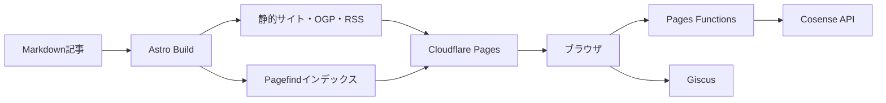

<h1 align="center">
  <picture>
    <source media="(prefers-color-scheme: dark)" srcset="./public/images/readme-title-dark.svg" />
    
  </picture>
</h1>

[kjr020.dev](https://kjr020.dev/) で公開している、Astroで開発した個人技術ブログです。
Cloudflare Pagesでホスティングし、記事や主要ページは静的サイトとして配信しています。


[](https://github.com/KJR020/kjr020-blog/actions/workflows/ci.yml)

## 主な機能

| 領域 | 機能 |
| --- | --- |
| コンテンツ管理 | MarkdownとAstro Content Collectionsによる記事管理 |
| 検索・回遊 | Pagefindによる全文検索、コマンドパレット、タグ分類 |
| 読書体験 | シンタックスハイライト、Mermaid、コールアウト、リンクカード、ライト／ダーク表示 |
| 配信・メタデータ | 記事別OGP画像、RSS、sitemap、JSON-LDのビルド時生成 |
| 外部連携 | Giscusによるコメント、Cloudflare Pages Functionsを介したCosense（旧Scrapbox）API連携 |

## 設計方針

ブログとしての表示速度とシンプルな配信構成を重視し、基本的にはAstroによる静的生成を採用しています。

クライアントサイドJavaScriptは検索やメニューなどインタラクションが必要な箇所に限定し、Reactコンポーネントとして実装しています。また、認証情報を扱う外部API通信はCloudflare Pages Functionsへ分離しています。

機能追加時には、静的生成で完結できるか、ブラウザでの実行が必要か、サーバー側へ分離すべきかを基準に実装場所を決めています。

## アーキテクチャ

記事と主要ページはビルド時に静的生成します。ブラウザで動くReactは検索、メニュー、目次、コメントなどに限定し、Cosense（旧Scrapbox）の認証情報が必要な通信だけをPages Functionsへ分離しています。



ビルド時と実行時のデータフロー、コンポーネント境界、設計判断は[アーキテクチャ概要](docs/architecture/overview.md)にまとめています。

## 技術スタック

| カテゴリ | 技術 |
| --- | --- |
| フレームワーク | [Astro](https://astro.build/) 7、[React](https://react.dev/) 19、TypeScript |
| コンテンツ | Astro Content Collections、Markdown |
| スタイリング | [Tailwind CSS](https://tailwindcss.com/) 4、CSS Custom Properties |
| 検索 | [Pagefind](https://pagefind.app/) |
| インフラ | [Cloudflare Pages](https://pages.cloudflare.com/)、Pages Functions |
| 品質管理 | Biome、Vitest、Playwright |
| CI/CD | GitHub Actions、Cloudflare Wrangler |

## プロジェクト構成

```text
content/posts/         ブログ記事のMarkdown
src/
├── components/        Astro／Reactコンポーネント
├── integrations/      Astro・Markdownのカスタム処理
├── layouts/           共通ページレイアウトとメタデータ
├── lib/               ルーティング、構造化データ、OGP生成など
├── pages/             静的ページ、RSS、OGP画像のルート
└── styles/            グローバル・記事向けスタイル
functions/             Cloudflare Pages Functions
scripts/               ビルド前処理とOGP生成
e2e/                   Playwright E2E・Visual Regressionテスト
docs/                  設計、開発・運用資料
```

## ローカル開発

Node.js 22.xとpnpm 11.xを使用します。

```shell
pnpm install
pnpm dev
```

開発サーバーは通常 `http://localhost:4321` で起動します。

Cosense（旧Scrapbox）API連携もローカルで動かす場合は、`.dev.vars.example` を参考に `.dev.vars` へ `SCRAPBOX_SID` を設定し、別のターミナルでPages Functionsを起動します。

```shell
pnpm exec wrangler pages dev --proxy 4321 --port 8788
```

### 主なコマンド

| コマンド | 説明 |
| --- | --- |
| `pnpm dev` | Astro開発サーバーを起動 |
| `pnpm build` | 本番用の静的サイトを生成 |
| `pnpm preview` | ビルド結果をローカルで配信 |
| `pnpm lint` | BiomeによるLint |
| `pnpm format:check` | フォーマット差分を確認 |
| `pnpm typecheck` | TypeScriptの型を検査 |
| `pnpm test:run` | Vitestを単発実行 |
| `pnpm test:coverage:check` | カバレッジ閾値を含めてVitestを実行 |
| `pnpm test:e2e` | Playwright E2Eテストを実行 |

### Visual Regressionスナップショット

`pnpm test:e2e:update-snapshots` は、ローカル環境向けの基準画像を更新します。CIで使用するLinux向けの `*-linux.png` は、GitHub Actionsの `CI` workflowを `update_snapshots=true` で手動実行して更新します。macOSからLinux向け画像を上書きしません。

## デプロイ

`main`へのpushを契機にGitHub Actionsがビルドし、Cloudflare Pagesへデプロイします。Pull RequestではLint、フォーマット、型、Unit／Component、カバレッジ、ビルド、E2Eを検証します。

## ドキュメント

- [アーキテクチャ](docs/architecture/)
- [開発](docs/development/)
- [セキュリティ](docs/security/)

## ライセンス

記事コンテンツおよびソースコードの著作権は著者に帰属します。本リポジトリにはオープンソースライセンスを設定していません。
