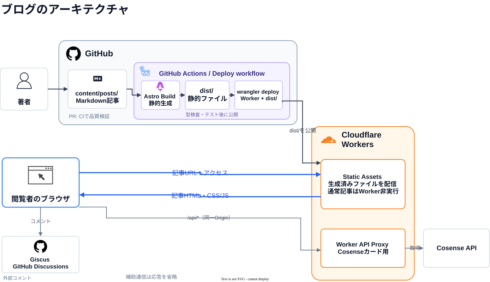

<h1 align="center">
  <a href="https://kjr020.dev/">
    <picture>
      <source media="(prefers-color-scheme: dark)" srcset="./public/images/readme-title-dark.svg" />
      
    </picture>
  </a>
</h1>

[kjr020.dev](https://kjr020.dev/)で公開している、Astroで開発した個人技術ブログです。<br />
Cloudflare Workersでホスティングし、記事や主要ページはStatic Assetsとして配信しています。


[](https://github.com/KJR020/kjr020-blog/actions/workflows/ci.yml)

## 主な機能

| 領域 | 機能 |
| --- | --- |
| コンテンツ管理 | MarkdownとAstro Content Collectionsによる記事管理 |
| 検索・回遊 | Pagefindによる全文検索、コマンドパレット、タグ分類 |
| 読書体験 | シンタックスハイライト、Mermaid、コールアウト、リンクカード、ライト／ダーク表示 |
| 配信・メタデータ | 記事別OGP画像、RSS、sitemap、JSON-LDのビルド時生成 |
| 外部連携 | Giscusによるコメント、Cloudflare Workersを介したCosense（旧Scrapbox）API連携 |

## 設計方針

ブログとしての表示速度とシンプルな配信構成を重視し、基本的にはAstroによる静的生成を採用しています。

ブラウザで実行するJavaScriptは、検索やメニューなどの操作に使います。対話的なUIはReactコンポーネントで実装します。認証情報を使うCosense APIへの通信は、Cloudflare Workers上のCosense API Proxyが担当します。

機能追加時には、静的生成で完結できるか、ブラウザでの実行が必要か、サーバー側へ分離すべきかを基準に実装場所を決めています。

## アーキテクチャ

Astroは、`content/posts/`のMarkdownから記事HTMLを静的生成します。生成した記事HTMLと関連ファイルは`dist/`に出力します。Cloudflare Workers Static Assetsが`dist/`を配信します。

`dist/`にはCSS、JavaScript、OGP画像、RSS、sitemap、Pagefindインデックスも含まれます。通常の記事配信ではWorkerコードを実行しません。

[](docs/architecture/blog-architecture.drawio.svg)

Cosenseカードは、同一オリジンの`/api/*`でCosense API Proxyを呼び出します。Cosense API Proxyは、Cosense用の認証情報とCloudflare Cache APIのキャッシュを管理します。GiscusはコメントをGitHub Discussionsに保存します。

ビルド時と実行時のデータフロー、コンポーネント境界、設計判断は[アーキテクチャ概要](docs/architecture/overview.md)にまとめています。

## コードの読みどころ

はじめて読む方に向けて、関心ごとの入口をまとめています。

| 関心 | 入口 | 内容 |
| --- | --- | --- |
| サーバー側の処理 | [worker/index.ts](worker/index.ts) → [worker/api/pages.ts](worker/api/pages.ts) → [worker/_lib/cms-proxy.ts](worker/_lib/cms-proxy.ts) | ルーティング、入力検証、上流APIのタイムアウト、公開用データへの変換、共有キャッシュ。仕様は[Cosense API Proxy](docs/architecture/cosense-api-proxy.md) |
| ビルド時の処理 | [astro.config.mjs](astro.config.mjs)、[src/integrations/](src/integrations/)、[src/lib/](src/lib/) | Markdownの変換、記事別OGP画像、構造化データ、公開入力の検査 |
| ブラウザで動くUI | [src/components/search/CommandPalette.tsx](src/components/search/CommandPalette.tsx)、[src/components/toc/](src/components/toc/) | 全文検索のコマンドパレット、スクロールに追従する目次 |
| テスト | [tests/worker/](tests/worker/)、[tests/e2e/](tests/e2e/) | Proxyの異常系とセキュリティ境界の検証、固定fixtureによるE2EとVisual Regression。方針は[テストアーキテクチャ](docs/architecture/test-architecture.md) |
| 設計判断の記録 | [docs/architecture/](docs/architecture/)、[意思決定ログ](docs/architecture/adr/) | 静的生成を既定にした理由、Workerを先に実行する範囲、コメント基盤の選定など |

## 技術スタック

| カテゴリ | 技術 |
| --- | --- |
| フレームワーク | [Astro](https://astro.build/) 7、[React](https://react.dev/) 19、TypeScript |
| コンテンツ | Astro Content Collections、Markdown |
| スタイリング | [Tailwind CSS](https://tailwindcss.com/) 4、CSS Custom Properties |
| 検索 | [Pagefind](https://pagefind.app/) |
| インフラ | [Cloudflare Workers](https://developers.cloudflare.com/workers/)、Static Assets |
| 品質管理 | Biome、Vitest、Playwright |
| CI/CD | GitHub Actions、Cloudflare Wrangler |

## プロジェクト構成

```text
content/posts/         ブログ記事のMarkdown
src/
├── components/        Astro／Reactコンポーネント
├── integrations/      Astro・Markdownのカスタム処理
├── layouts/           共通ページレイアウトとメタデータ
├── lib/               ルーティング、構造化データ、OGP生成など
├── pages/             静的ページ、RSS、OGP画像のルート
└── styles/            グローバル・記事向けスタイル
worker/                Cosense API Proxyとリクエストルーター
scripts/               ビルド前処理、OGP生成、マスコットの動きのレビュー
tests/
├── src/               `src/` を対象とするUnit／Componentテスト
├── worker/            `worker/` を対象とするテスト
├── e2e/               Playwright E2E・Visual Regressionテスト
└── setup.ts           Vitest共通セットアップ
docs/                  設計、開発・運用資料
```

テストコードは`tests/`へ集約します。実装と検証を分け、テスト全体を一か所から確認するためです。

`tests/src/`と`tests/worker/`は、対象実装のディレクトリ構成とファイル名を引き継ぎます。実装側のパスから、対応するテストの配置先を判断できます。

## ローカル開発

Node.js 22.xとpnpm 11.xを使用します。

```shell
pnpm install
pnpm dev
```

開発サーバーは通常`http://localhost:4321`で起動します。

Cosense API連携をローカルで確認する場合は、次の手順を使います。

1. [ローカル環境変数のサンプル](.dev.vars.example)を参考に、`.dev.vars`へ`SCRAPBOX_SID`を設定する
2. `pnpm build`で静的ファイルを生成する
3. `pnpm exec wrangler dev --port 8788`でAPIと静的ファイルの配信を起動する

```shell
pnpm build
pnpm exec wrangler dev --port 8788
```

`http://localhost:8788`から開くと、APIと静的ページを同一オリジンで確認できます。静的ページを変更した場合は再ビルドしてください。`pnpm dev`単独ではCosense API Proxyは動作しません。

### 主なコマンド

| コマンド | 説明 |
| --- | --- |
| `pnpm dev` | Astro開発サーバーを起動 |
| `pnpm build` | 本番用の静的サイトを生成 |
| `pnpm preview` | ビルド結果をローカルで配信 |
| `pnpm lint` | BiomeによるLint |
| `pnpm format:check` | フォーマット差分を確認 |
| `pnpm typecheck` | TypeScriptの型を検査 |
| `pnpm test:run` | Vitestを単発実行 |
| `pnpm test:coverage:check` | カバレッジ閾値を含めてVitestを実行 |
| `pnpm test:e2e` | LinuxコンテナでPlaywright E2Eテストを実行 |

### Visual Regressionスナップショット

ローカルで基準画像を更新する場合は、次の手順を使います。

1. Dockerを起動する
2. `pnpm test:e2e:update-snapshots`を実行する
3. 更新された`*-linux.png`を確認する
4. 意図した差分だけであることを確認してコミットする

このコマンドは、CIと同じPlaywright Linuxコンテナを使います。Compose構成はE2EとVRTを対象とし、Astro開発サーバーを含みません。

GitHub Actionsで更新する場合は、`CI` workflowを`update_snapshots=true`で手動実行します。

VRTのfixture、外部依存、E2Eとの責務分担は[テストアーキテクチャ](docs/architecture/test-architecture.md)で定義しています。

## デプロイ

`main`へのpushで、Deploy workflowがビルド、型検査、テストを実行します。検査の成功後、`wrangler deploy`でWorkerコードと`dist/`をデプロイします。デプロイ後は疎通確認を実行します。

Pull Requestでは、CI workflowがリント、整形、型、UnitとComponent、カバレッジ、ビルド、E2Eを検証します。

Secret、CD用トークン、カスタムドメインの管理は[Cloudflare Workers運用手順](docs/development/workers-operations.md)を参照してください。

### デプロイ後の確認

1. [Deploy workflow](.github/workflows/deploy.yml)の成功と、反映されたコミットを確認する
2. 公開サイトでホームと記事を開き、表示とリンク遷移を確認する
3. APIやデプロイ設定を変更した場合は、デプロイ先で次のリクエストを実行し、正常な取得と入力の拒否を確認する

```shell
BASE_URL="https://kjr020.dev"
curl -i "$BASE_URL/api/pages/KJR020"
curl -i "$BASE_URL/api/pages/invalid-project"
```

APIの応答では、次を確認します。

- 正常系のJSON、ステータス、キャッシュヘッダーが[Cosense API Proxy仕様](docs/architecture/cosense-api-proxy.md#api仕様)と一致する
- 不正な入力に400を返す
- APIレスポンスに`Access-Control-Allow-Origin`が付かない

確認に失敗した場合は、workflowと実行環境のログ、接続先、`SCRAPBOX_SID`の設定を確認します。

## ドキュメント

- [アーキテクチャ](docs/architecture/)
- [開発](docs/development/)
- [デザイン](docs/design/)
- [セキュリティ](docs/security/)

## ライセンス

記事コンテンツおよびソースコードの著作権は著者に帰属します。本リポジトリにはオープンソースライセンスを設定していません。
