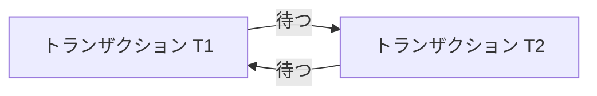

トランザクションの理解を深めたいと思い、ChatGPTと会話しながらいろいろと調べていました。
その中でデッドロックの話になり、「そもそもデッドロックが発生したときって、どうやって対応するんだろう？」という疑問が出てきました。

この記事では、デッドロックを調べる中で、これまで別々に考えていた知識が「依存関係をグラフとして捉える」という見方でつながっていった過程を、学習記録としてまとめます。

## デッドロックはどうやって解消するのか？

データベースにおけるデッドロックは、複数のトランザクションがお互いの保持するロックの解放を待ち続けて、処理を進められなくなった状態です。

仕組みはなんとなく理解していたつもりでしたが、発生したデッドロックをどうやって解消するのかは、よく分かっていませんでした。

調べてみると、PostgreSQLには、デッドロックを検出し、関係するトランザクションの一つを中断・ロールバックすることで、待ち状態を解消する仕組みがあります。[^1]

ここで次に気になったのが、「では、DBはどうやってデッドロックが発生したと判断しているのだろう？」ということでした。

## DBはどうやってデッドロックを検出するのか？

ChatGPTに尋ねながら調べてみると、トランザクション間の待ち関係を有向グラフとして捉えるWait-for Graph（待ちグラフ）という考え方があることを知りました。データベースのロック待ちでは、トランザクションをノード、「相手のロック解放を待っている」という関係をエッジとして表現できます。[^2]

例えば、T1がT2を待ち、T2もT1を待っている状態は次のようになります。ここでは矢印を「待つ側 → 待たれる側」とします。

矢印をたどっていくと、最終的に自分自身へ戻ってきます。ここで扱っているロック待ちのモデルでは、この循環がデッドロックに対応します。[^2]

それまで、「互いにロックの解放を待っている」という状態をDBがどうやって判定するのかイメージできていませんでした。Wait-for Graphとして見ると、デッドロックを「待ち関係に循環があるか」という問題として考えられることが分かりました。

## これってDAGの話と似ている？

Wait-for Graphについて調べていて、以前、依存関係のあるタスクをDAGとして扱う処理を実装したことを思い出しました。

そのときは、タスク間の依存関係をもとにトポロジカルソートを行い、タスクを並列に実行していました。また、依存関係に循環がある場合はエラーにしていました。

一方、Wait-for Graphでは、トランザクションの待ち関係に循環が見つかると、デッドロックと判断します。正確には、Wait-for Graphは循環を含むことがあるため、常にDAGというわけではありません。ですが、どちらも「関係を有向グラフとして表現し、循環を検出する」という考え方は共通していました。

以前は別々に思えていた「タスクの実行順序を決める問題」と「デッドロックを検出する問題」が、どちらも「有向グラフとして表現された関係を扱う問題」であり、同じ枠組みで捉えられることに気づきました。

## グラフとして捉えることと、内部の実装

ここまで考えて、「RDBMSも内部でトランザクションの待ち関係を有向グラフとして管理しているのだろうか？」と気になりました。

以前は、ライブラリにカプセル化されたグラフを扱っていたため、Wait-for Graphとしてモデル化できるなら、内部にもグラフを表すデータ構造がそのまま存在するのだと思っていました。

少し調べてみると、グラフはノードとエッジの関係として考えられ、それをプログラム上で表現する方法として、隣接リストや隣接行列などがあるようです。[^5]

つまり、「グラフ」という決まった一つのデータ構造があるというより、グラフとして捉えた関係を、何らかのデータ構造で表現するという見方の方が近そうです。

ではPostgreSQLでは実際にどうなっているのだろうと思い、実装を見てみました。

PostgreSQLの開発者向け文書では、プロセスをノード、待ち関係をエッジとするWait-for Graphとしてデッドロック検出を説明しています。[^3]

詳細については割愛しますが、実装を確認すると、Wait-for Graph全体を一つの専用データ構造として保持しているわけではありません。プロセスやロック、待ち行列の情報から待ち関係をたどり、探索中に必要なエッジを`EDGE`構造体として記録しています。[^4]

ここまで調べて、自分の中で「グラフとして問題を捉えること」と「その関係を実際のデータとしてどう表現するか」を少し混同していたことに気づきました。

少なくともPostgreSQLのデッドロック検出では、Wait-for Graph全体に対応する一つのデータ構造があるのではなく、内部にあるデータ同士の関係をノードとエッジとして見ることで、グラフとして扱っているようです。

## まとめ

最初は「デッドロックって発生したらどうするんだろう？」という疑問から調べ始めましたが、そこからWait-for Graphを知り、以前扱ったDAGとの共通点に気づきました。

処理の実行順序とトランザクションの待ち関係は、それまで別々の話として覚えていました。それが、どちらも「依存関係を有向グラフとして捉える」ことができ、デッドロックも「トランザクションの待ち関係に循環ができた状態」として考えると、自分の中ではかなり腹落ちしました。

コンピュータサイエンスを体系的に学んでいれば当たり前の考え方なのかもしれませんが、自分にとっては、これまで別々に持っていた知識がつながった感覚がありました。

今回調べたことで、何らかの依存関係を扱うときに「これはグラフとして扱うと良さそうだ」という視点が一つ増えたように思います。

[^1]: デッドロックの自動検出とトランザクションの中断、ロック取得順序の統一、再試行について。[PostgreSQL 18.4文書「13.3.4. デッドロック」](https://www.postgresql.jp/document/18/html/explicit-locking.html#LOCKING-DEADLOCKS)
[^2]: Wait-for Graphのノードとエッジの定義、サイクルによるデッドロック検出について。[Wait-for graph - Wikipedia](https://en.wikipedia.org/wiki/Wait-for_graph)
[^3]: `src/backend/storage/lmgr/README`は、PostgreSQL内部のロック管理について開発者向けに説明した文書。プロセスをWait-for Graphのノード、待ち関係をエッジとして扱い、`FindLockCycle()`がエッジを再帰的にたどる方法が説明されている。[PostgreSQL 18.6 `src/backend/storage/lmgr/README` 393〜449行](https://github.com/postgres/postgres/blob/REL_18_6/src/backend/storage/lmgr/README#L393-L449)（2026年9月確認）
[^4]: `EDGE`構造体は`waiter`、`blocker`、`lock`を保持する（[`deadlock.c` 37〜54行](https://github.com/postgres/postgres/blob/REL_18_6/src/backend/storage/lmgr/deadlock.c#L37-L54)）。循環の探索では、`visitedProcs`配列に探索済みのプロセスを記録し（[`deadlock.c` 102〜104行](https://github.com/postgres/postgres/blob/REL_18_6/src/backend/storage/lmgr/deadlock.c#L102-L104)、[`deadlock.c` 472〜509行](https://github.com/postgres/postgres/blob/REL_18_6/src/backend/storage/lmgr/deadlock.c#L472-L509)）、`waitLock`から対象のロックを取得して、`procLocks`から競合するロックの保持者を探している（[`deadlock.c` 535〜585行](https://github.com/postgres/postgres/blob/REL_18_6/src/backend/storage/lmgr/deadlock.c#L535-L585)）。また、`waitProcs`はそのロックを待つプロセスの待ち行列として参照される（[`deadlock.c` 630〜703行](https://github.com/postgres/postgres/blob/REL_18_6/src/backend/storage/lmgr/deadlock.c#L630-L703)）。（2026年9月確認）
[^5]: グラフを構成するノードとエッジ、および隣接リストや隣接行列などの代表的な表現方法について。[Graph (abstract data type) - Wikipedia](https://en.wikipedia.org/wiki/Graph_%28abstract_data_type%29)（2026年9月確認）
