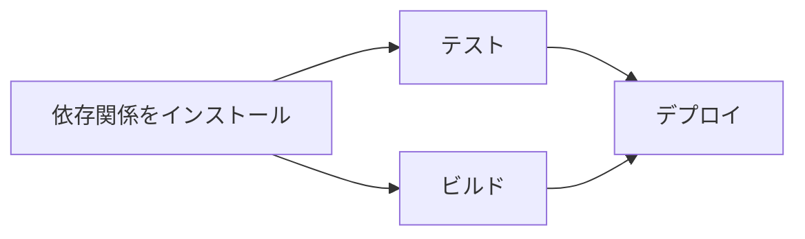
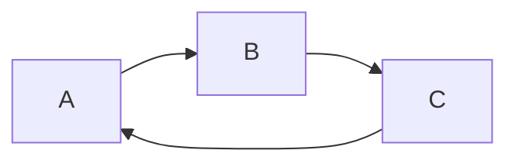

以前、依存関係のあるタスクを並列実行する実装で、Pythonの `graphlib.TopologicalSorter` を使いました。

当時は必要なAPIや使い方を調べながら実装しましたが、トポロジカルソートそのものについて体系的に整理する機会はありませんでした。

そこで今回は、トポロジカルソートの基本的な性質と `TopologicalSorter` の使い方を改めて整理します。

なお、トポロジカルソートを求める方法には、Kahn のアルゴリズムや DFS を使う方法があります。今回は `TopologicalSorter` の内部実装や、アルゴリズムの詳細までは扱いません。

## トポロジカルソートとは

トポロジカルソートは、「Aを終えてからBを行う」のような前後関係を守って、要素を一列に並べる方法です。

一般的なソートは、数値の大小や文字列の辞書順で要素を並べます。トポロジカルソートでは、要素同士の依存関係から順序を決めます。

## DAGとは

すべてのノードをトポロジカル順序に並べられるグラフは、DAG（Directed Acyclic Graph、有向非巡回グラフ）です。

* Directed: 辺に向きがある
* Acyclic: 経路をたどって出発点へ戻る循環がない
* Graph: ノードと、それらを結ぶ辺で関係を表す

例として、テストとビルドを終えてからデプロイする流れを考えます。依存関係は次のようになります。



このグラフには、次の制約があります。

* テストとビルドは、依存関係のインストール後に行う
* デプロイは、テストとビルドの両方が終わってから行う

テストとビルドの間には前後関係がありません。そのため、このグラフを一列に並べる方法は一つだけではありません。

## Pythonでの実装

Pythonでは、3.9から標準ライブラリの `graphlib` に `TopologicalSorter` が用意されています[^1]。

先ほどの依存関係を辞書で表し、`static_order()` で並び順を取得します。

```python
from graphlib import TopologicalSorter


graph = {
    "依存関係をインストール": set(),
    "テスト": {"依存関係をインストール"},
    "ビルド": {"依存関係をインストール"},
    "デプロイ": {"テスト", "ビルド"},
}

sorter = TopologicalSorter(graph)
order = tuple(sorter.static_order())

print(order)
```

実行結果の一例は次のとおりです。

```text
('依存関係をインストール', 'テスト', 'ビルド', 'デプロイ')
```

`TopologicalSorter` へ渡す辞書は、キーにノード、値にそのノードより前に処理するノードを指定します。例えば、`"デプロイ": {"テスト", "ビルド"}` は「デプロイはテストとビルドに依存する」という依存関係になります。


## 並び順の一意性

先ほどの例では、次の順序も正しい結果です。

```text
('依存関係をインストール', 'ビルド', 'テスト', 'デプロイ')
```

テストとビルドは互いに依存していないため、どちらが先でも制約を満たします。公式ドキュメントにも、同じ段階にあるノードの順序は、グラフへ追加した順序に影響されると説明されています[^1]。

そのため、テストではタプル全体を一つの正解と比較するより、必要な前後関係が守られているかを確認する方が、トポロジカルソートの性質に合っています。

この例なら、確認したいのは次の関係です。

- 依存関係のインストールが、テストとビルドより前にある
- テストとビルドが、デプロイより前にある

## 循環参照

循環する依存関係があると、すべての依存関係を満たす実行順序を決められません。

例えば、AはCを待ち、BはAを待ち、CはBを待つとします。どのノードから始めても、先に終わらせるべき別のノードが残ってしまいます。



`TopologicalSorter` では、このようなグラフに対して `static_order()` を実行すると `CycleError` が発生します[^1]。

```python
from graphlib import CycleError, TopologicalSorter


cyclic_graph = {
    "A": {"C"},
    "B": {"A"},
    "C": {"B"},
}

try:
    tuple(TopologicalSorter(cyclic_graph).static_order())
except CycleError:
    print("循環する依存関係があります")
```

タスクの実行を始める前に循環を検出できれば、「互いに完了を待ち続けて処理を始められない」という状態を避けられます。

## トポロジカルソートを使う場面

- ビルドやデプロイに含まれるタスクの実行順序
- データ処理パイプラインの前処理と後処理の順序
- 履修条件のある科目を学ぶ順序
- パッケージやモジュールの依存関係の解決

共通しているのは、「すべてに固定の順番があるわけではないが、一部の前後関係は必ず守る必要がある」ことです。

## 実装時の考慮点

`TopologicalSorter` には、依存関係が解消されたノードを取得する `get_ready()` や、処理の完了を通知する `done()` も用意されています。

実務で使用した際には、これらを使った並列実行や、同時実行数、失敗時の扱いも考慮して設計しました。今回はトポロジカルソートの基本的な性質と `TopologicalSorter` の使い方に焦点を当てるため、並列実行の実装については割愛します。

## まとめ

トポロジカルソートは、DAGに含まれる依存関係を守りながら、ノードを一列に並べる方法です。

Pythonでは `TopologicalSorter` に「ノードと、その前に処理するノード」の対応を渡し、`static_order()` を呼ぶことでトポロジカル順序を取得できます。

実務で依存関係のあるタスクを並列実行した際には、各タスクの実行時間は実際に動かしてみるまで分からず、依存関係のないタスクがどの順番で完了するかも決まりませんでした。

必要なのはすべてのタスクの順番を固定することではなく、必要な前後関係だけを守ることです。今回トポロジカルソートを整理したことで、実務で扱っていたこの性質を、改めて言葉として整理できました。

[^1]: `TopologicalSorter` はPython 3.9で追加されました。入力する辞書はキーをノード、値をそのノードの先行ノードの集合として表し、`static_order()` はトポロジカル順のイテレーターを返します。循環を検出した場合は `CycleError` が発生します。[graphlib — Functionality to operate with graph-like structures](https://docs.python.org/3/library/graphlib.html)（2026年9月確認）

## 参考

<https://docs.python.org/3/library/graphlib.html>
