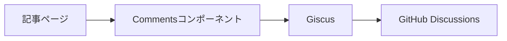

# コメント機能

記事ページに埋め込むGiscusの構成、設定、表示条件を定義する。採用時の判断は[コメント基盤へのGiscus採用](adr/0001-adopt-giscus.md)に記録する。

## 構成

記事ページはReactコンポーネントの`Comments`をブラウザで描画する。`Comments`は`@giscus/react`を通じてコメント欄を表示する。GiscusはコメントをGitHub Discussionsに保存する。ブログ側にはコメント保存用のAPIやデータベースを持たない。

## 設定と表示条件

- 記事ページで`PUBLIC_GISCUS_*`の環境変数を読み取り、`Comments`へ渡す
  - 接続先リポジトリとカテゴリの名前・IDを指定する。設定項目は[環境変数のサンプル](../../.env.example)を参照する
- リポジトリ名、リポジトリID、カテゴリ名、カテゴリIDのいずれかが未設定の場合、コメント欄を表示しない
  - ブラウザのコンソールに設定不足の警告を出力する
- GitHub Actionsのビルドでは、`pnpm build`の後処理でコメント欄に設定が埋め込まれていることを検査する
  - 設定が欠けてもビルドは成功し、本番でコメント欄が表示されないことに気づきにくいため
  - `REQUIRE_COMMENTS=true`で検査を有効にする。設定を持たないローカルビルドとE2Eのビルドでは検査しない
- 記事ページの`client:only="react"`指定で、コメント欄をブラウザ側で描画する
- Giscusの読み込みには遅延読み込みを指定する

## 記事との対応とテーマ

- 記事URLの`pathname`を使ってDiscussionを対応づける
- サイトのライトモード・ダークモードにコメント欄のテーマを合わせる
  - `MutationObserver`で`html`要素の`class`属性を監視し、`dark`クラスの有無からテーマを切り替える

Giscusへ渡す設定値は[コメントコンポーネント](../../src/components/Comments.tsx)、依存パッケージのバージョンは[パッケージ定義](../../package.json)を参照する。

## 制約

- コメントの投稿にはGitHubアカウントが必要
- コメントの閲覧・投稿はGiscusとGitHub Discussionsの稼働状況に依存する
- 記事のパスを変更する場合、既存のDiscussionとの対応を確認する必要がある
  - 対応づけに`pathname`を使用するため
- 不適切なコメントは運営者がGitHub Discussions上で管理する

## 関連ファイル

- [記事ページ](../../src/pages/posts/%5B...slug%5D.astro) - 環境変数の読み取りとコメント欄の配置
- [コメントコンポーネント](../../src/components/Comments.tsx) - 表示条件、Giscusへの設定、テーマの連動
- [コメント基盤へのGiscus採用](adr/0001-adopt-giscus.md) - 採用時の前提、比較、判断

## 参考資料

- [Giscus公式](https://giscus.app/ja) - コメントの仕組みと設定方法
