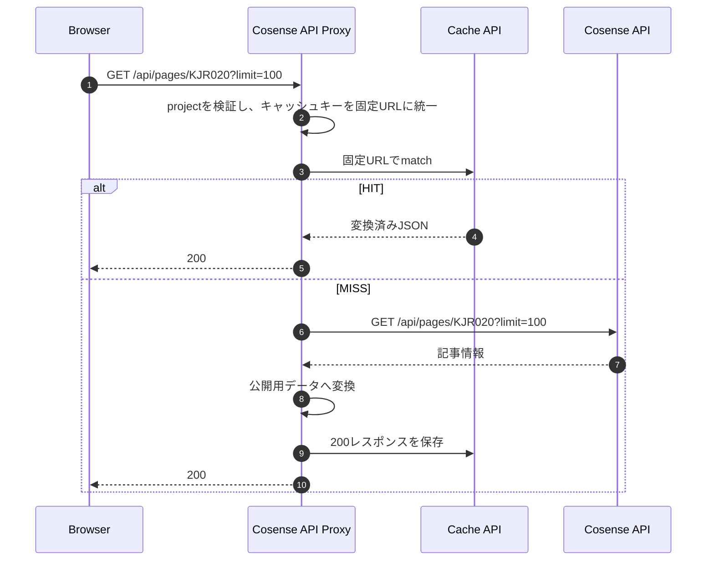

# Cosense API Proxy

Cosenseの記事情報を、秘密情報をBrowserへ公開せずブログに提供するための構成を定義する。

## 概要

ブログはAstroで静的生成し、Cosenseの記事情報だけをBrowserから動的に取得する。

- BrowserはCosense APIを直接呼び出さず、同一OriginのCosense API Proxy（Cloudflare Workers上で実行）を介する
- Cosense API Proxyは入力検証、認証付きの上流取得、公開用データへの変換、共有キャッシュを担当する
  - ブログの再ビルドなしで記事情報を更新し、Cosense APIへの呼び出しと上流待ち時間を抑える
  - 更新の即時反映やデータセンター間でのキャッシュ同期は要求しない

## データフロー



## コンポーネントと責務

- React Query
  - Browser内のデータ取得状態と再取得を管理する
- Browser HTTP cache
  - 同じBrowserからの再取得を抑制する
- Cosense API Proxy
  - 入力検証、上流取得、レスポンス変換、エラー制御を行う
- Cloudflare Cache API
  - 変換済みレスポンスをデータセンター単位で共有する
- Cosense API
  - 記事情報を提供する

## API仕様

```http
GET /api/pages/KJR020?limit=100
```

- Methodは`GET`、projectは`KJR020`のみを受け付ける
- Cosenseからの取得件数は100件に固定する
  - Browserから受け取るquery parameterはすべて無視する
  - 上流へ送る取得条件とキャッシュキーには、Cosense API Proxy側で固定した`limit=100`を使用する
- 応答は公開用ページデータの配列とし、[PageData](../../worker/_lib/cms-proxy.ts)を型の正とする
  - `KJR020`から取得したページはすべて公開対象とし、`PageData`に定義した項目だけを返す
  - 0件なら空配列を返し、順序はCosense APIの取得順を維持する
  - 変換に必要な項目の型が不正なページが1件でもあれば、部分的な成功にはせず全体をエラーとする

## キャッシュ

- React Query：`staleTime: 300秒`
  - 同じQueryClientとquery keyを使うBrowser内でデータをfreshとみなす期間
  - 期限切れや定期更新の設定ではなく、画面を開いたままにしても自動更新は保証しない
  - ウィンドウ復帰時の再取得は無効とする
- Browser HTTP cache：`max-age=300`
  - 各Browserで再利用する
- Cloudflare Cache API：`s-maxage=600`
  - Cloudflareの各データセンターで共有する

成功レスポンスは、Browser向けの`max-age`と共有キャッシュ向けの`s-maxage`を分けて指定する。

```http
Cache-Control: public, max-age=300, s-maxage=600
```

Cache APIのキーは次のURLに正規化する。

```text
https://<deployment-host>/api/pages/KJR020?limit=100
```

- Browserから受け取った不要なquery parameterはキーに含めない
- ProductionとPreviewはホスト名ごとに別のキャッシュを使用する
- HIT時は保存済みのJSONを返し、Cosense APIを呼び出さない
- MISS時はCosense APIから取得し、公開用JSONへの変換に成功した200レスポンスだけを保存する
  - 期限切れのキャッシュは返さない
  - 同時MISSによる上流取得の重複は許容する
- キャッシュは取得処理の最適化として扱う
  - 読み取りに失敗した場合はMISSとして上流取得へ進む
  - 保存に失敗しても、取得・変換済みの200レスポンスを返す
  - キャッシュ操作の失敗は秘密情報を含めずに記録する
- Cache APIのHITでもCosense API Proxyは実行される
  - 削減するのはCosenseへの通信と変換処理であり、Cloudflare Workersへの呼び出し回数ではない
- 更新は各キャッシュの状態とBrowserの再取得契機に応じて反映される
  - 更新反映までの厳密な上限時間は保証しない

## エラー処理

- 400：不正なproject
- 500：`SCRAPBOX_SID`が未設定
- 502：Cosense APIから正常な公開用データを取得できない
  - 上流が4xx・5xxまたはリダイレクトを返す、通信に失敗する、JSONを変換できない場合
  - 上流のリダイレクトは追跡しない
- 504：Cosense APIが5秒以内に応答しない
  - 上流への接続開始からJSON本文の読み取り完了までを制限する
- エラーレスポンスは保存せず、`Cache-Control: no-store`を付与する
  - Cosenseの応答本文、内部エラー、`SCRAPBOX_SID`をBrowserへ返さない

## セキュリティ境界

### 秘密情報

- `SCRAPBOX_SID`はCloudflare Workersのsecretとして管理し、Cosense APIへの接続だけに使う
- 本APIは呼び出し元の認証を行わない公開APIであり、閲覧者によらず同じレスポンスを返す
  - Cosense APIのレスポンスはそのまま返さず、第三者に公開してよいページデータだけへ変換する

### CORS

- Browserはページと同じOriginの相対URL`/api/pages/...`を呼び出す
- APIレスポンスに`Access-Control-Allow-Origin`は付与せず、cross-originのBrowser JavaScriptからの読み取りを許可しない
  - CORSはAPI自体へのアクセスを制限する認証・認可の仕組みではない

## 環境設定

- Production
  - 公開Origin：`https://kjr020.dev`
  - `SCRAPBOX_SID`：Cloudflare Workers secret
  - 実行経路：Cloudflare Workers上のCosense API Proxy
- workers.dev
  - 公開Origin：`https://kjr020-blog.johnjiro1114.workers.dev`
  - 本番と同じデプロイ先 `kjr020-blog` とSecretを使用する。PRごとの自動Previewデプロイは行っていない
- Local
  - 公開Origin：`http://localhost:8788`
  - `SCRAPBOX_SID`：`.dev.vars`
  - `pnpm build` 後に `pnpm exec wrangler dev --port 8788` を実行する
  - WranglerのOriginから開き、`/api/*` はCosense API Proxy、それ以外はビルド済み `dist/` を配信する

設定方法は[Cloudflare Workers運用手順](../development/workers-operations.md)を参照する。

## 関連ファイル

- [アーキテクチャ概要](overview.md) - ブログ全体の構成
- [Cosense APIエンドポイント](../../worker/api/pages.ts) - Cosense API Proxyのハンドラ
- [Cosense Proxy](../../worker/_lib/cms-proxy.ts) - Cosense API接続とレスポンス変換
- [HTTPレスポンス](../../worker/_lib/http.ts) - Cache-Controlとエラーレスポンス
- [Cosenseデータ取得](../../src/components/scrapbox/useScrapboxData.ts) - BrowserからのAPI呼び出し
- [React Query設定](../../src/components/scrapbox/queryClient.ts) - Browser内の再取得ポリシー

## 参考資料

- [Cloudflare Cache API](https://developers.cloudflare.com/workers/runtime-apis/cache/)
- [Workers Secrets](https://developers.cloudflare.com/workers/configuration/secrets/)
