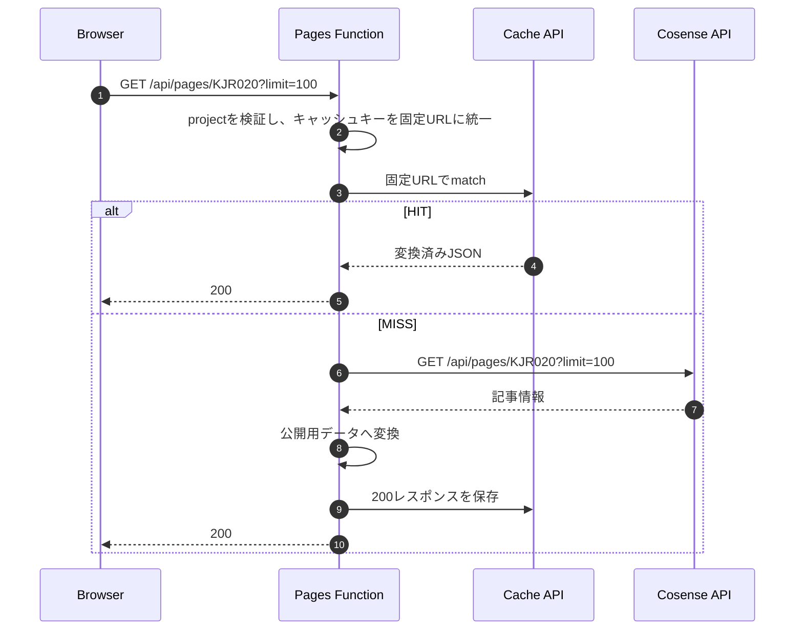

# Cosense API Proxy

Cosenseの記事情報を、秘密情報をBrowserへ公開せずブログに提供するための構成を定義する。

## 概要

ブログはAstroで静的生成し、Cosenseの記事情報だけをBrowserから動的に取得する。BrowserはCosense APIを直接呼び出さず、同一OriginのCloudflare Pages Functionを介する。

Pages Functionは入力検証、Cosenseへの認証付きリクエスト、公開用データへの変換、共有キャッシュを担当する。ブログの再ビルドなしで記事情報を更新しつつ、Cosense APIへの呼び出しと上流待ち時間を抑える。更新の即時反映やデータセンター間でのキャッシュ同期は要求しない。

## データフロー



## コンポーネントと責務

| コンポーネント | 責務 |
| --- | --- |
| React Query | Browser内のデータ取得状態と再取得を管理する |
| Browser HTTP cache | 同じBrowserからの再取得を抑制する |
| Pages Function | 入力検証、上流取得、レスポンス変換、エラー制御を行う |
| Cloudflare Cache API | 変換済みレスポンスをデータセンター単位で共有する |
| Cosense API | 記事情報を提供する |

## API仕様

```http
GET /api/pages/KJR020?limit=100
```

| 項目 | 仕様 |
| --- | --- |
| Method | `GET` |
| project | `KJR020`のみ |
| Cosense取得件数 | 100件 |
| 応答 | 公開用ページデータの配列。型は`PageData`を正とする |

Browserから受け取るquery parameterはすべて無視する。Cosense APIへ送る取得条件とキャッシュキーには、Pages Function側で固定した`limit=100`を使用する。結果が0件なら空配列を返し、順序はCosense APIの取得順を維持する。

## キャッシュ

| レイヤー | 時間に関する設定 | 範囲 |
| --- | --- | --- |
| React Query | `staleTime: 300秒` | 同じQueryClientとquery keyを使うBrowser内 |
| Browser HTTP cache | `max-age=300` | 各Browser |
| Cloudflare Cache API | `s-maxage=600` | Cloudflareの各データセンター |

React Queryの`staleTime`はデータをfreshとみなす期間であり、期限切れや定期更新の設定ではない。画面を開いたままにしても自動更新は保証しない。ウィンドウ復帰時の再取得は無効とする。

成功レスポンスは、Browser向けの`max-age`と共有キャッシュ向けの`s-maxage`を分けて指定する。

```http
Cache-Control: public, max-age=300, s-maxage=600
```

Cache APIのキーは次のURLに正規化する。Browserから受け取った不要なquery parameterはキーに含めない。ProductionとPreviewはホスト名ごとに別のキャッシュを使用する。

```text
https://<deployment-host>/api/pages/KJR020?limit=100
```

Cache APIがHITした場合は保存済みのJSONを返し、Cosense APIを呼び出さない。MISSした場合はCosense APIから取得し、表示用JSONへの変換に成功した200レスポンスだけを保存する。期限切れのキャッシュは返さない。同時MISSによる上流取得の重複は許容する。

キャッシュは取得処理の最適化として扱う。読み取りに失敗した場合はMISSとして上流取得へ進み、保存に失敗しても取得・変換済みの200レスポンスを返す。キャッシュ操作の失敗は秘密情報を含めずに記録する。Cache APIのHITでもPages Functionは実行されるため、削減するのはCosenseへの通信と変換処理であり、Functionの呼び出し回数ではない。

更新は各キャッシュの状態とBrowserの再取得契機に応じて反映される。更新反映までの厳密な上限時間は保証しない。

## エラー処理

| 条件 | HTTP status |
| --- | --- |
| 不正なproject | 400 |
| Cosense APIが5秒以内に応答しない | 504 |
| Cosense APIが4xx・5xxを返す | 502 |
| Cosense APIのJSONを変換できない | 502 |
| `SCRAPBOX_SID`が未設定 | 500 |

エラーレスポンスは保存せず、`Cache-Control: no-store`を付与する。Cosenseの応答本文、内部エラー、`SCRAPBOX_SID`をBrowserへ返さない。

## セキュリティ境界

### 秘密情報

`SCRAPBOX_SID`はCloudflare Pagesのsecretとして管理し、Cosense APIへの接続だけに使う。本APIは呼び出し元の認証を行わない公開APIであり、閲覧者によらず同じレスポンスを返す。Cosense APIのレスポンスはそのまま返さず、第三者に公開してよいページデータだけへ変換する。

### CORS

Browserはページと同じOriginの相対URL`/api/pages/...`を呼び出す。APIレスポンスに`Access-Control-Allow-Origin`は付与せず、cross-originのBrowser JavaScriptからの読み取りを許可しない。CORSはAPI自体へのアクセスを制限する認証・認可の仕組みではない。

## 環境設定

| 環境 | 公開Origin | `SCRAPBOX_SID` | 実行経路 |
| --- | --- | --- | --- |
| Production | `https://kjr020.dev` | Cloudflare Pages secret | Pages Function |
| Preview | Preview deploymentのOrigin | Cloudflare Pages secret | Pages Function |
| Local | WranglerのOrigin | `.dev.vars` | Wrangler Pages Function |

ローカル開発ではWranglerのOriginからページを開く。Wranglerは`/api/...`をPages Functionで処理し、それ以外をAstro開発サーバーへProxyする。

## 関連ファイル

- [アーキテクチャ概要](overview.md) - ブログ全体の構成
- [Cosense APIエンドポイント](../../functions/api/pages/%5Bproject%5D.ts) - Pages Functionの入口
- [Cosense Proxy](../../functions/_lib/cms-proxy.ts) - Cosense API接続とレスポンス変換
- [HTTPレスポンス](../../functions/_lib/http.ts) - Cache-Controlとエラーレスポンス
- [Cosenseデータ取得](../../src/components/scrapbox/useScrapboxData.ts) - BrowserからのAPI呼び出し
- [React Query設定](../../src/components/scrapbox/queryClient.ts) - Browser内の再取得ポリシー

## 参考資料

- [Cloudflare Cache API](https://developers.cloudflare.com/workers/runtime-apis/cache/)
- [Cloudflare Pages Functions bindings](https://developers.cloudflare.com/pages/functions/bindings/)
