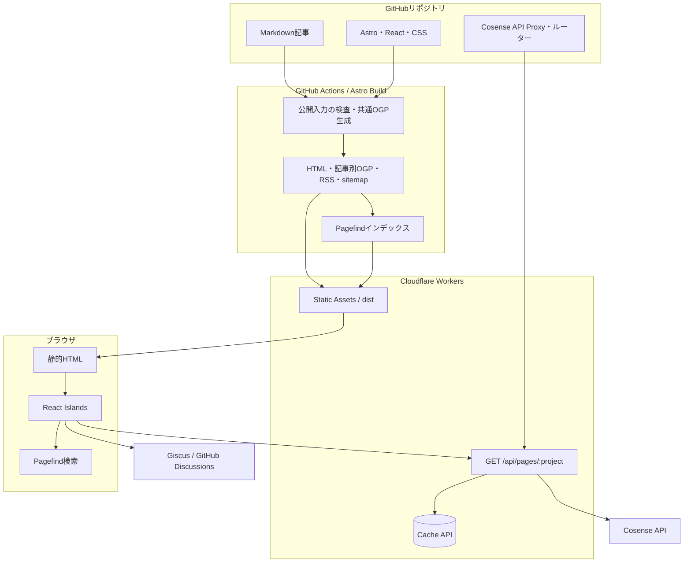
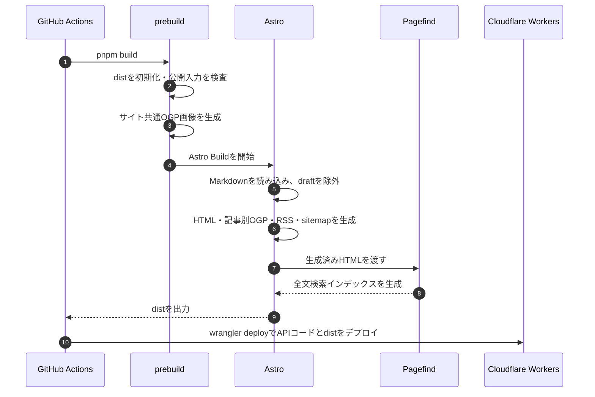

# アーキテクチャ概要

KJR020's Blogのビルド時処理、ブラウザ実行、外部サービス連携の境界を説明する。

## 全体像

アプリケーションの中心は静的サイトである。Cloudflare Workers上のCosense API Proxyは、秘密情報をブラウザへ渡さずにCosense（旧Scrapbox）APIへ接続するための小さな境界としてのみ使用する。

## コンポーネントと責務

| 領域 | 主な責務 | 実行タイミング |
| --- | --- | --- |
| `content/posts/` | 記事本文とfrontmatter | 編集時 |
| `src/pages/` | ページ、RSS、記事別OGPのルーティング | ビルド時 |
| `src/layouts/` | 共通HTML、OGP、JSON-LD、サイト全体の枠組み | ビルド時 |
| `src/components/` | Astroの静的UIとReactの対話的UI | ビルド時／ブラウザ |
| `src/integrations/` | AstroとMarkdownのカスタム処理 | ビルド時／開発時 |
| `src/lib/` | ルーティング、構造化データ、OGP生成などのドメインロジック | ビルド時／テスト時 |
| `worker/` | Cosense API Proxy、入力検証、キャッシュ、エラー制御 | リクエスト時 |
| `scripts/` | 公開入力の検査、出力の初期化、共通OGP生成 | ビルド前 |

## ビルド時のデータフロー

MarkdownはAstro Content Collectionsで型検証する。Remark／Rehypeプラグインがコールアウト、リンクカード、Mermaid、記事画像のfigure化を担当する。リンクカードは通常ビルド時に外部ページのメタデータを取得するため、テストでは `LINK_CARD_FETCH_MODE=offline` にして外部通信を切り離す。

## ブラウザ実行と外部サービス

基本のHTMLとCSSは静的に配信し、操作が必要な箇所だけReact IslandsとしてHydrationする。

| 機能 | 実行場所 | 通信先 |
| --- | --- | --- |
| 全文検索・コマンドパレット | ブラウザ | 配信済みPagefindインデックス |
| モバイルメニュー・テーマ切替・目次 | ブラウザ | なし |
| コメント | ブラウザ | Giscus / GitHub Discussions |
| Cosenseカード | ブラウザ＋Cosense API Proxy | Cosense API |

Cosense（旧Scrapbox）連携では、ブラウザが同一Originの`/api/pages/:project`を呼び出す。Cosense API Proxyはプロジェクト名を検証し、Cloudflare側の`SCRAPBOX_SID`を使ってCosense APIへ接続する。レスポンスは表示に必要な項目だけへ変換し、Browserで300秒、Cloudflare Cache APIで600秒キャッシュする。エラーは保存しない。cross-originのBrowser JavaScriptからの読み取りは許可しない。詳細は[Cosense API Proxy](cosense-api-proxy.md)に定義する。

## 設計上の判断

### 静的生成を既定にする

記事、一覧、タグ、RSS、OGPは更新頻度より配信効率を優先し、ビルド時に生成する。常駐するアプリケーションサーバーを持たず、配信経路を単純に保つ。

### Reactを操作のある箇所に限定する

ページ全体をSPAにせず、検索、コメント、目次、テーマ切替などに `client:load` または `client:only` を指定する。記事本文と主要なナビゲーションはJavaScriptが実行される前から利用できる。

### 秘密情報をCosense API Proxyへ隔離する

Cosenseのセッション情報は公開バンドルへ含めない。Proxyは外部APIレスポンスをそのまま中継せず、フロントエンド向けの型へ変換する。

### Cloudflare Workersでのルーティング

ここでWorkerとは、Cloudflare Workersにデプロイするリクエスト処理プログラム（`worker/index.ts`）を指す。

`wrangler.toml` の `run_worker_first = ["/api/*"]` によりAPIだけをWorkerで先に処理する。通常の静的ページはStatic Assetsが配信し、Worker側へ届いた未一致リクエストは `env.ASSETS.fetch` へ委譲する。`true` にすると静的閲覧にもWorkerの実行コストと障害の影響が及ぶため使用しない。

`compatibility_date` は移行前と同じ `2025-03-01` を維持し、ランタイムの挙動変更と配信基盤の移行を分離する。navigationリクエストの静的404配信は `assets_navigation_prefers_asset_serving` フラグで有効化する。

## CI/CDと品質境界

Pull Requestでは以下を独立したGitHub Actionsジョブとして実行する。

- BiomeによるLintとフォーマット確認
- TypeScriptの型検査
- VitestによるUnit／Component／Cosense API Proxy・ルーターテスト
- 80%の閾値を持つカバレッジ計測
- Astroの本番ビルド
- PlaywrightによるE2EとVisual Regressionの検証

`main`へのpush後は別のdeploy workflowが同じ本番ビルドを実行し、Wrangler経由でCloudflare Workersへデプロイする。

## 環境変数と秘密情報

| 変数 | 用途 | 境界 |
| --- | --- | --- |
| `PUBLIC_GISCUS_*` | Giscusのリポジトリ・カテゴリ設定 | 公開されるビルド時設定 |
| `SCRAPBOX_SID` | Cosense APIへの接続（変数名は旧名称を維持） | Cloudflare Workersのsecret／ローカルの`.dev.vars` |
| `LINK_CARD_FETCH_MODE` | リンクカードの外部取得を切り替える | ビルド・テストプロセス |
| `CLOUDFLARE_API_TOKEN` | Cloudflare Workersへのデプロイ | GitHub Actions secret |
| `CLOUDFLARE_ACCOUNT_ID` | デプロイ先アカウントの指定 | GitHub Actions secret |
| `TAKUMI_GUARD_TOKEN` | npm Proxyへの認証 | GitHub Actions／Dependabot secret |

## 関連ファイル

- [Astro設定](../../astro.config.mjs) - IntegrationとMarkdown処理
- [Content Collections設定](../../src/content.config.ts) - 記事スキーマ
- [ビルド前処理](../../scripts/prepare-public-build.ts) - 出力初期化、公開入力検査、共通OGP生成
- [Cosense APIエンドポイント](../../worker/api/pages.ts) - Cosense API Proxyのハンドラ
- [Cosense Proxy](../../worker/_lib/cms-proxy.ts) - 外部API接続とレスポンス変換
- [HTTPポリシー](../../worker/_lib/http.ts) - Cache-Controlとエラーレスポンス
- [Cosense API Proxy仕様](cosense-api-proxy.md) - 入力、キャッシュ、エラー、セキュリティ仕様
- [CI workflow](../../.github/workflows/ci.yml) - Pull Requestの品質検証
- [Deploy workflow](../../.github/workflows/deploy.yml) - Cloudflare Workersへのデプロイ
- [テストアーキテクチャ](test_architecture.md) - テスト種別と配置方針
