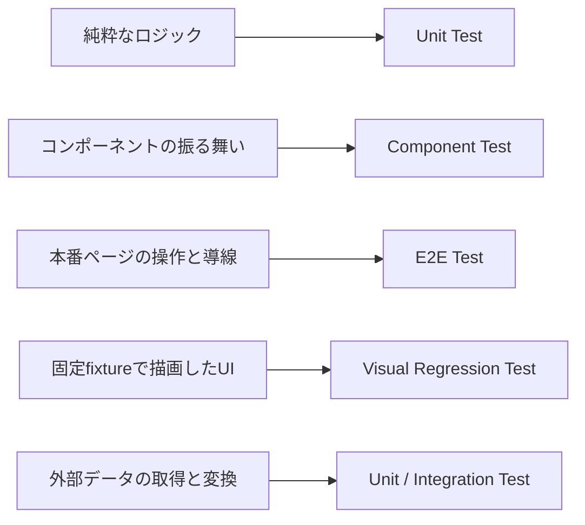

# Test Architecture

このドキュメントは、プロジェクトのテスト戦略と方針を定義する。
具体的なコマンドと設定値は、各設定ファイルと `package.json` をSource of Truthとする。

## 概要

### 目的
- コード品質の継続的な検証
- リファクタリング時の回帰バグ防止
- CI/CD パイプラインでの自動テスト実行

### テストフレームワーク
- **Vitest**: Unit / Component テスト用の Vite ネイティブテストランナー
- **Playwright**: E2E / Visual regression テスト用のブラウザテストランナー

### テストの責務

同じ Playwright を使うテストでも、E2E と Visual Regression Test（VRT）では
検証対象とデータの扱いを分ける。



| テスト種別 | 主な検証対象 | データ |
|------|------|------|
| Unit | 純粋関数、変換、分類 | テストケース内で固定 |
| Component | UIの状態と操作 | props、モックで固定 |
| E2E | 本番ページの導線とユーザー操作 | 実コンテンツを許容 |
| VRT | レイアウト、スタイル、レスポンシブ表示 | 専用fixtureで固定 |
| Integration | 外部データの取得、ビルド時変換 | 境界でレスポンスを固定 |

### ファイル配置
Unit / Component テストファイルは、ソースファイルと同じディレクトリに配置する（コロケーション）。

```
src/
├── lib/
│   ├── utils.ts          # ソースファイル
│   └── utils.test.ts     # テストファイル
└── components/
    └── ui/
        ├── button.tsx
        └── button.test.tsx
```

E2E テストは `playwright.config.ts` の `testDir` に合わせて配置する。現状は `e2e/` を使用している。

```
e2e/
├── header.spec.ts
├── snapshot.spec.ts
├── snapshot.css
└── helpers/
    └── snapshot.ts
```

## テスト対象の評価基準

新しいテストを追加する際は、以下の観点で評価する。

| 観点 | 説明 |
|------|------|
| **テスト価値** | バグ発見・回帰防止にどれだけ貢献するか |
| **実装コスト** | テスト作成にかかる工数・複雑さ |
| **メンテナンスコスト** | コード変更時にテストも変更が必要になる頻度 |
| **依存関係** | 外部ライブラリ・DOM・ブラウザ API への依存度 |
| **ビジネス影響** | バグがあった場合のユーザー影響 |

### 優先度ガイドライン

| 優先度 | 条件 |
|--------|------|
| **高** | テスト価値が高く、実装コストが低い（純粋関数、ユーティリティ） |
| **中** | テスト価値は高いが、DOM モック等の追加設定が必要 |
| **低** | 外部ライブラリのラッパーや、単純な表示コンポーネント |

## テスト種別

### Unit Tests
- 純粋関数、ユーティリティ関数
- テスト環境: `jsdom`（現行設定）
- 依存関係: なし

### Component Tests
- React コンポーネントのロジック
- テスト環境: `jsdom`
- 依存関係: `@testing-library/react`

### E2E Tests
- Playwright を使用
- 配置: `e2e/**/*.spec.ts`
- `pnpm test:e2e` で実行
- 本番ページのリンク遷移、検索、表示順、件数、インタラクションをDOMで検証する
- 記事タイトルや記事数の変化を、画像差分ではなく意味のあるアサーションで検証する
- E2Eの成否を、外部サービスの可用性や応答内容へ依存させない

### Visual Regression Tests

VRTは、意図しないレイアウトやスタイルの変更を検出する。記事や外部サービスの
更新を検出するテストにはしない。

#### VRT対象

- `src/vrt/pages/` のVRT専用ページ、またはデザインシステムの標本を撮影する
- 本番と同じコンポーネント、レイアウト、スタイルを使って描画する
- Desktop / Mobile、Light / Darkなど、仕様として維持する表示条件を網羅する
- ページ全体を確認する場合も、実記事ではなく固定fixtureでページを構成する

VRT専用ページは開発サーバーと `VRT_FIXTURES=true` のテストビルドで `/__vrt/*` に公開し、
通常の本番ビルドには含めない。本番ページとVRT専用ページは `src/components/pages/` の
ページコンポーネントを共有し、前者には実データ、後者には `src/vrt/fixtures.ts` の固定データを渡す。
`e2e/snapshot.spec.ts` はVRT専用ページだけを撮影する。

#### fixtureの要件

- 記事タイトル、日付、タグ、件数、画像サイズを固定する
- 長いタイトル、複数行、空状態など、守りたいレイアウト条件を明示して含める
- リンクカードは外部URLから取得せず、解決済みのカードデータを渡す
- 現在時刻、乱数、ネットワーク、実コンテンツの追加・編集へ依存させない
- fixtureはテスト対象の近くに置き、用途が分かる名前を付ける

#### 外部依存とビルド時処理の境界

Playwrightの通信モックが介入できるのは、ページを開いた後にブラウザが行う通信だけである。
Astroのビルド時に `getCollection()` で読み込む記事や、Markdown変換中に生成する
リンクカードは、完成済みHTMLとしてブラウザへ渡されるため、通信モックでは固定できない。

外部データを扱う機能は、取得・変換と描画を分ける。取得・変換はUnitまたは
Integration Testで検証し、VRTでは解決済みの固定データを描画コンポーネントへ渡す。

#### スナップショットを安定させるルール

- コンテンツ領域をmaskして差分を隠さない
- 外部ウィジェットを含むページをそのままVRT対象にしない
- アニメーションと開発ツールの影響を除く
- フォント、画像、Astro Islandの準備完了後に撮影する
- 基準画像は、意図したUI変更があった場合だけ更新する

#### 実行環境

- `playwright.config.ts` のDesktop ChromeとMobile Chromeで実行する
- macOSとLinuxの基準画像を分けて管理する
- ローカルではmacOS用、CIの通常実行ではLinux用の基準画像と比較する
- Linux用の基準画像はGitHub Actionsの手動workflowで更新する

記事追加や記事本文の編集だけで基準画像の更新が必要になった場合は、VRT対象が
実コンテンツへ依存していないかを先に確認する。画像の更新で差分を受け入れることを
通常の解決方法にしない。

## 実行と設定

実行コマンドは [README](../../README.md) に記載する。テスト対象、カバレッジ、
ブラウザ、CIの具体的な設定はドキュメントへ転記せず、関連する設定ファイルを直接参照する。

## 関連ファイル

- [playwright.config.ts](../../playwright.config.ts) - E2EとVRTのPlaywright設定
- [playwright.design-system.config.ts](../../playwright.design-system.config.ts) - デザインシステムのブラウザテスト設定
- [snapshot.spec.ts](../../e2e/snapshot.spec.ts) - 固定fixtureページのVRT
- [snapshot.ts](../../e2e/helpers/snapshot.ts) - 撮影前の安定化と画像比較
- [snapshot.css](../../e2e/snapshot.css) - 撮影時のアニメーションと開発UIの制御
- [fixtures.ts](../../src/vrt/fixtures.ts) - VRTへ渡す固定データ
- [VRT pages](../../src/vrt/pages/) - 開発サーバーとテストビルドだけで公開する撮影対象ページ
