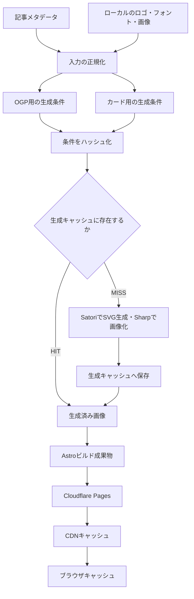
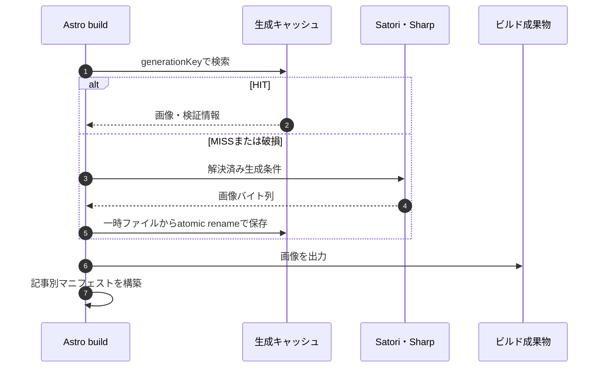

# Thumbnail / OGP生成・キャッシュ設計案

記事の入力データと生成基盤を共通化し、OGPはタイトル中心、カード用サムネイルはビジュアル中心の別テンプレートで生成する。

状態: Draft実装あり。2026-09-14作成。生成・静的配信設定・学習コマンドを実装済み。本番デプロイ、Cloudflare上の観測、無料枠確認は未実施。以下の設計のうち旧デプロイ再実行時の保持は運用runbook記載の制限が残る。

## 全体像



生成はNode.js上のビルド時に行う。HTTPリクエスト時のCDN MISSは、Pagesの配信元から生成済みファイルを取得する動作であり、画像の再生成ではない。

| 構成要素 | 責務 |
| --- | --- |
| 記事アダプター | 公開記事だけを共通入力へ変換する |
| ロゴレジストリ | タグの表記を正規化し、ローカル素材を選ぶ |
| テンプレート | OGP・カードそれぞれの構図を定義する |
| 生成条件・キー | 入力、素材、描画処理、出力条件を識別する |
| 生成キャッシュ | 同じ条件でのSatori・Sharp実行を省く |
| マニフェスト | 記事ID・用途から生成URLと寸法を引く |
| Pages・CDN | 生成済みファイルを配信する |
| ブラウザ | HTTPキャッシュ方針に従ってレスポンスを再利用する |

## 1. 現状と対象範囲

現状はAstroの静的ビルドをGitHub ActionsからCloudflare Pagesへデプロイしている。記事別OGPは`src/pages/og/posts/[...slug].png.ts`で生成し、固定URL `/og/posts/{記事ID}.png` を使用する。Satori、Sharp、日本語フォントは導入済み。

Homeのfeatured PostCardは画像の下にタイトル・説明・メタ情報を表示し、既定画像に記事OGPを使用している。Archive・Tag一覧は画像なしの全幅行。HomeのScrapbox欄は外部プロジェクトのデータを取得し、既存の`imageUrl`を表示している。

初期対象は公開ブログ記事のOGPとHomeのfeaturedカード。Archive・Tag一覧の密度は維持する。「Scrapbox風の記事カード」はブログ記事に適用する見た目として扱い、外部Scrapbox記事の画像生成は追加段階とする。外部記事へ展開する際は、取得時点のメタデータを固定した入力アダプターと更新契機を別途設計する。

## 2. 表示設計

| 項目 | OGP | カード用サムネイル |
| --- | --- | --- |
| 主目的 | サイト外で記事内容・発信元を伝える | 一覧で記事の技術やテーマを見分ける |
| タイトル | 全文を主役として表示 | 画像内に表示せず、HTMLのタイトルで読む |
| ブログ名 | 表示 | 省略 |
| 投稿日 | 既存の表示を引き継ぐ | カードのメタ情報で表示 |
| 技術ロゴ | 補助要素として最大3個 | 主役として最大3個 |
| カテゴリ | 設定があれば補助表示 | 配色・図形選択の手がかり |
| 枠・影 | 既存OGPの表現を出発点にする | 画像内にカード枠や影を重ねない |

### カード用の構図

中央に技術ロゴを1〜3個置き、周囲に十分な余白を取る。1個なら中央、2個なら横並び、3個なら主ロゴをやや大きくする。小さな文字や記事タイトルは描かない。ロゴ0個でも生成できる共通図形を用意する。

背景はサイトの面・境界に合わせた控えめな中立色を基準にし、ロゴ本来の色をアクセントにする。初期はライト・ダーク共通の画像1種類とし、両テーマで境界やロゴが見えることを実画面で確認する。テーマ別画像は必要になってから追加する。

同じ技術の記事は似た画像になる。サムネイルは技術を見分ける補助であり、記事の識別はHTMLタイトルが担う。固有の図やスクリーンショットが必要な記事には既存の`heroImage`指定を優先する。

現在の固定高さ・`object-fit: cover`から、生成画像を使うカードは16:9の表示領域へ変更する案とする。重要な要素は中央80%以内に置く。HTMLには`width`・`height`を付けて領域を予約し、スクリーン上の位置に応じて遅延読み込みを選ぶ。

生成画像はタイトルやタグを補助する装飾として`alt=""`とする。独自情報を持つ手動画像は既存の`heroImage.alt`を使う。カード全体のリンク名は記事タイトルから得る。

### 出力プリセット

| 名前 | サイズ | 形式 | 用途 |
| --- | --- | --- | --- |
| `ogp` | 1200×630 | PNG | SNS共有・構造化データ |
| `card-sm` | 480×270 | WebP、quality 80 | 小さなカード |
| `card-lg` | 960×540 | WebP、quality 80 | 広いカード・高密度画面 |

カードは同じ構図から2サイズを生成し、`srcset`と実際のGridに合う`sizes`を使用する。任意サイズ・任意形式の公開APIは作らない。

## 3. 入力とロゴ

| 入力 | 扱い |
| --- | --- |
| `articleId` | 記事の対応づけに使用。ファイルパスへ直接連結しない |
| `title` | 必須。両用途のキーに含め、カードに描かなくてもタイトル変更へ追従する |
| `tags` | 未指定は空配列。前後空白・Unicodeを正規化し、順序を維持して重複除去 |
| `category` | 現行スキーマにないため任意項目として追加。ディレクトリから暗黙推測しない |
| `publishedAt` | OGP表示用。カードのキーには含めない |
| `heroImage` | カードの手動画像として優先。初期の加工・生成キャッシュ対象外 |

ロゴはタグの別名をレジストリで対応させる。例: `react` / `React` → `react`、`ts` / `TypeScript` → `typescript`。記事タグ順に対応ロゴを選び、同じロゴは1回だけ表示し、最大3個に制限する。未登録タグは無視し、画像生成を失敗させない。

レジストリにはID、別名、ローカルSVG、出典・利用条件を記録する。実装時に公式ブランドガイドを確認した素材だけを登録する。生成時に外部URLへ取りに行かない。未登録タグと、登録済み素材の欠損は区別し、後者はビルドエラーで検知する。

背景・余白は`globals.css`を正規の値とする方針。Draft実装では`tokens.ts`に生成用の値を分離した段階で、CSSトークンとの自動接続は未完。実装ファイルのハッシュをキーに含める。

## 4. 生成条件とキャッシュキー

キーは、正規化した生成条件のcanonical JSONをSHA-256でハッシュ化する。キー名を再帰的にソートし、配列の表示順は維持する。デフォルト値は明示的に解決する。

```text
generationKey = sha256(canonicalJson(resolvedGenerationSpec))

/generated-images/card/{generationKey}.webp
/generated-images/ogp/{generationKey}.png
```

これは完成画像そのもののハッシュではなく、生成条件のハッシュ。同じキーで異なる画像を上書きしないことを不変条件とする。

| 条件 | キーへの反映 |
| --- | --- |
| 正規化したタイトル・タグ・カテゴリ | 両用途に含める |
| 用途・プリセット・寸法・形式・品質 | 含める |
| テンプレートID・用途別バージョン | 含める |
| 使用テンプレートと共通描画コードのダイジェスト | 含める。バージョン更新忘れを補完 |
| 選択したロゴのID・表示順・素材バイト列のハッシュ | 含める |
| 使用するフォント・写真・解決済みデザイントークン | 含める |
| Satori・Sharpのバージョン、実行環境識別子 | 含める。OS差のある生成結果を混用しない |
| 投稿日・ブログ名 | 使用するOGPの条件に含める |
| ビルド時刻・ランダム値・無関係な本文 | 含めない |

用途別テンプレートのダイジェストを分けるため、カードだけの構図変更でOGPのキーは変わらない。共通描画コードを変えた場合は両方変わる。使用していないロゴの追加ではキーを変えない。

カードのタイトルは描画しないが、当初の更新要件に合わせてキーに残す。タイトルを変更すると同じ見た目の画像を再生成する場合がある。後に「画素を変える入力だけをキーにする」方式と比較できる実験点とする。

## 5. 生成キャッシュとAstroへの接続



ローカルの`.cache/generated-images/`へ画像と検証情報（サイズ、形式、バイト列のダイジェスト）を保存し、Git管理対象外にする。HIT時もファイル欠損・破損を確認し、不正なら再生成する。保存失敗はビルドを失敗させ、壊れたURLを公開しない。

Astroの静的エンドポイントで公開記事を列挙し、共通の`createThumbnailSpec`でカード・OGPのキーとURLを計算する。`/generated-images/card/{key}.webp`と`/generated-images/ogp/{key}.png`が生成キャッシュを使って画像を出力する。ビルドフックや独自のMarkdownパーサーは追加しない。

`/generated-images-manifest.json`は公開記事と画像参照を出力する検証用マニフェスト。カード・記事ページも同じ生成条件関数を使用する。devではAstroのエンドポイントとして動作し、buildでは静的ファイルになる。

```text
manifest[articleId] = {
  ogp: { url, width, height, type },
  card: { small: { url, width, height }, large: { url, width, height } }
}
```

PostCardは手動画像がなければ共通生成条件の`card`を参照し、記事ページは`ogp`をBaseLayout/BaseHeadへ渡す。URLを各所で組み立てない。共通サイトOGPは既存の`/og-image.png`を維持し、この固定URLにはimmutableを適用しない。

GitHub Actionsは現在依存パッケージのキャッシュだけなので、画像キャッシュのrestore/saveを追加する。外側の保存キーはOS・描画環境・実行単位を含め、新しい実行では同じ環境の直近キャッシュを復元する。記事ごとの再利用可否は内側のgenerationKeyで判断する。キャッシュ未復元時も全件再生成して正常にビルドできることを必須とする。

## 6. HTTP配信と更新

ハッシュ付き画像だけに、Pagesの`_headers`で次を付ける。

```text
/generated-images/*
  Cache-Control: public, max-age=31536000, immutable
```

この設定はブラウザ向けの長期再利用方針。CDN側の保持期間や実際のHITは別途観察し、同じ期間の保持を保証したと解釈しない。Pagesの配信挙動を基準にし、既存のゾーン設定・Cache Rulesはデプロイ検証時に確認する。ダッシュボード設定は現時点で未調査。

画像URLの変更と、新しいURLを参照するHTMLの公開を同じデプロイで行う。HTMLはimmutableにせず、再検証できる方針にする。画像URLだけ変えても、古いHTMLやSNS側の独自キャッシュが更新されるとは限らない。SNSには再取得の確認を別途行う。

古いハッシュURLの保持はキャッシュと分離する。初期案は直前の本番デプロイが参照した画像を、GitHub Actionsのデプロイ成果物から取得して次の成果物にも含める。本番マニフェストと画像を復元できない場合は公開を止める（初回導入はgit treeから確認する）。現行の復元対象選択にはrun再実行時の制限があるため、[運用runbook](../operations/thumbnail-deployment.md)を参照する。キャッシュ復元だけに旧URLの可用性を依存させない。

この方式が保証する旧画像の範囲は直前の本番デプロイまで。任意の過去URLの永久保持は初期対象外で、長期保持が必要になった時点でR2等を比較する。旧固定URL `/og/posts/{記事ID}.png` は移行期間中に互換出力を残す。

Pagesの静的レスポンスには`_headers`が適用されるが、Pages Functionsで返すレスポンスにはコードでヘッダーを付ける必要がある。[Cloudflare Headers](https://developers.cloudflare.com/pages/configuration/headers/)

## 7. 学習と観測

学習は「予想を書く → 1条件だけ変える → 観測する → 理由を説明する」を1単位にする。

| 段階 | 実験 | 確認する証拠 |
| --- | --- | --- |
| 1. 生成 | 同じ記事を同条件で2回生成 | MISS→HIT、描画呼び出し1回、時間差 |
| 2. 更新 | タイトルだけ変更 | 新キー・新URL。カードは同じ見た目でもよい |
| 3. 分離 | カードテンプレートだけ変更 | カードMISS、OGP HIT |
| 4. 素材 | 選択されたロゴのSVGを変更 | 使用記事のキーが変化。未使用記事は不変 |
| 5. 再生成 | ローカル生成キャッシュを消す | 同一環境なら同じキー・画像を再生成 |
| 6. CDN | 同じ画像URLをcurlで複数回GET | Cache-Control、ETag、CF-Cache-Status、Age等の実際の値 |
| 7. Browser | 通常の再訪と再検証を比較 | memory/disk cache、転送量、200/304の違い |
| 8. 公開更新 | タイトル変更後にデプロイ | HTMLの参照先と画像URLが同時に更新 |

生成ログは`layer=generation`、用途、プリセット、キー、`HIT/MISS`、`lookupMs`、`renderMs`、`totalMs`、bytesを記録する。HITでは`renderMs=0`。CIキャッシュ復元ログと画像ごとのHITを区別する。

CDN実験はブラウザキャッシュを持たないcurlを使い、同一URLを変更せずGETする。キャッシュバスターのクエリは足さない。HITを保証するのではなく、MISSが続く場合も拠点・設定・失効を調べる。初期のCDN実験は配信時間の比較であり、生成時間の比較ではない。

ブラウザ実験はDevToolsのDisable cacheをオフにした通常再訪から始める。リロードは再検証を起こす場合があるため区別する。ブラウザHITで表示されたHTTPヘッダーは過去のレスポンスのものであり、その時点のCDN HITを示すものではない。PagesはETagによる条件付きリクエストに対応する。[Serving Pages](https://developers.cloudflare.com/pages/configuration/serving-pages/)

### 追加実験: Worker Cache API

静的配信の理解後、公開ブログと分けた検証用経路で、既知の画像IDだけを受け付けるPages Functionを作る。`caches.default.match`がMISSなら静的成果物を取得し、成功した画像レスポンスだけを`put`する。任意URL・任意サイズ・任意クエリは拒否する。

保存するレスポンスには実験用の短いTTLを付け、ブラウザへ返すコピーは`Cache-Control: no-store`にしてCache APIの観測を優先する。`X-Thumbnail-Edge-Cache: HIT|MISS`は取り出したコピーへ毎回付け、保存時のMISSラベルを返し続けない。

Cache APIはデータセンター単位で、Tiered Cacheへ自動連携しない。HITでもFunction自体は実行される。ローカルエミュレーションはCloudflare上の挙動確認の代替にしない。[Cache API](https://developers.cloudflare.com/workers/runtime-apis/cache/)

この追加実験でもMISS時は画像の取得であり生成ではない。リクエスト時生成を体験する場合は、まずNode.jsローカルで同じ生成器をHTTP経由で呼び出す。Cloudflare上へ移すにはレンダラーの実行互換性とCPU予算を別途検証する。

## 8. 保存・コスト・制限

| データ | 保存先と扱い |
| --- | --- |
| 記事、ロゴ、フォント、テンプレート | Git管理する原本 |
| 生成キャッシュ | ローカル・CIの再利用領域。消えても再生成可能 |
| 現在の公開画像 | Pagesデプロイ成果物。配信元として必要 |
| 直前の公開画像 | 成功済みデプロイ成果物から引き継ぐ |
| CDN・ブラウザ内のコピー | 消える可能性がある配信キャッシュ |

R2・Cloudflare Imagesの有料機能は初期構成に追加しない。既存のGitHub Actions上で生成し、Pagesの静的配信を使う。ただし「無料枠内」を設計だけで保証せず、アカウントの契約、CI実行時間、成果物保存容量、生成ファイル数を公開前に確認する。

記事N件に対して通常3N画像を基本上限とし、旧画像引き継ぎを含む総数・総容量をビルドログへ出す。検証段階で1記事あたりの生成時間と画像サイズを測り、既存サイト分と合算してサービス上限に収まることを確認する。

追加のWorker実験はFreeプランの範囲で行い、上限到達時の停止を許容する。現行のWorkers Freeには日次リクエスト上限と1回あたりCPU時間10msの制限がある。画像生成が収まることを前提にしない。[Workers pricing](https://developers.cloudflare.com/workers/platform/pricing/)

## 9. 実装単位と受け入れ条件

1. **1記事の生成実験**: 共通入力・キー・ディスクキャッシュを作り、MISS/HITと生成回数を検証する。
2. **カードテンプレート**: ロゴあり1/2/3個、未知タグ、ロゴなしを確認する。既存OGPとの分離をテストする。
3. **ビルド統合**: 公開記事マニフェストと画像を生成し、記事ページ・Homeカードから参照する。下書きが含まれないことを確認する。
4. **表示確認**: 長い日本語タイトル、手動画像、ライト/ダーク、Desktop/Mobileを`/design-system`で確認する。実装・関連ガイド・標本を同じ変更で更新し、`pnpm test:design-system`を実行する。
5. **公開実験**: CIキャッシュ復元、旧画像保持、HTTPヘッダー、CDN・ブラウザの挙動を記録する。画像とHTMLの参照整合をビルド検査する。
6. **追加の比較実験**: Cache APIとローカルのリクエスト時生成を必要に応じて実施する。

キーのテストは同値入力、条件変更、素材変更、用途の独立性を検証する。キャッシュのテストはHIT時の描画未実行、破損からの再生成を検証する。画像の一致だけでHITしたと判定しない。

初期完了は1〜5。これで記事別生成、技術ロゴ、カード表示、OGP、生成結果の再利用、HIT/MISS、更新追従、Browser/CDN比較を扱う。無料枠の完了条件は実際の契約・使用量確認を含む。外部Scrapboxの新規生成、R2、Cloudflare上のオンデマンド画像生成は追加段階。

## 関連ファイル

- [記事別OGPエンドポイント](../../src/pages/og/posts/[...slug].png.ts)
- [既存画像テンプレート](../../src/lib/og-image/template.tsx)
- [PostCard](../../src/components/PostCard.astro)
- [BaseHead](../../src/layouts/BaseHead.astro)
- [記事スキーマ](../../src/content.config.ts)
- [ScrapboxCard](../../src/components/scrapbox/ScrapboxCard.tsx)
- [デプロイworkflow](../../.github/workflows/deploy.yml)
- [デザインシステム](../blog-design-system.md)
- [Grid system](../grid-system.md)
