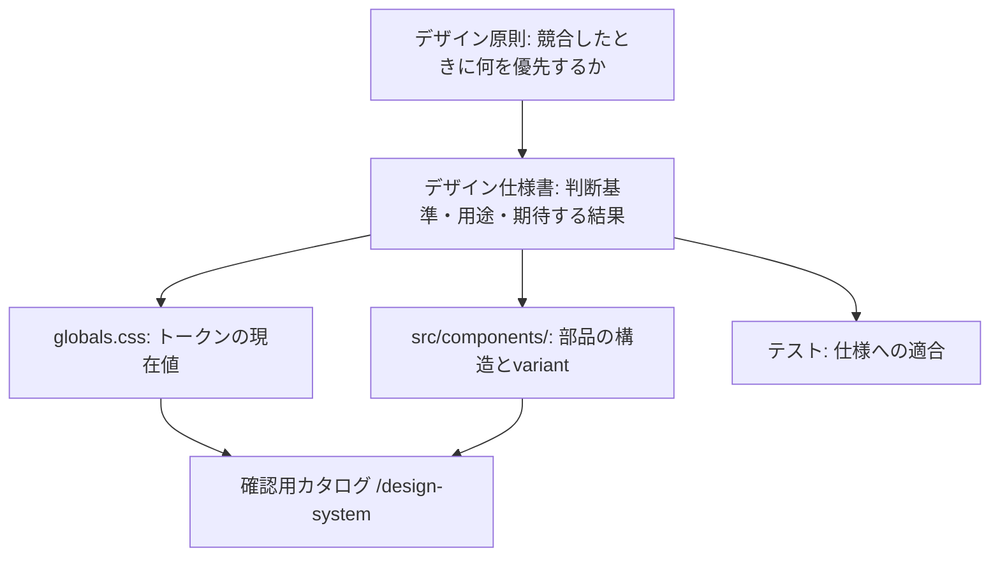

# KJR020's Blogデザイン仕様

この文書は、KJR020's Blogのデザイン原則と、個別仕様・実装の参照先を定義する。

具体的な色、書体、寸法、部品は、原則を実現するための仕様として定める。それらを維持すること自体を目的にしない。

## 用語

この文書群では、次の3つを区別する。

| 用語 | 指すもの |
| --- | --- |
| デザインシステム | 原則・仕様・トークン・実コンポーネント・確認手段を含む体系全体 |
| デザイン仕様書 | この文書群。判断基準、用途、制約、期待する振る舞いを定義する |
| 確認用カタログ | 開発時限定の`/design-system`。実装を表示・操作して確認する。独立した実装や別の仕様正本を持たない |

## 全体像

```mermaid
graph TB
    P["デザイン原則: 競合したときに何を優先するか"]
    D["デザイン仕様書: 判断基準・用途・期待する結果"]
    T["globals.css: トークンの現在値"]
    C["src/components/: 部品の構造とvariant"]
    E["テスト: 仕様への適合"]
    K["確認用カタログ /design-system"]

    P --> D
    D --> T
    D --> C
    D --> E
    T --> K
    C --> K
```

原則が仕様を導き、仕様が値と実装を導く。確認用カタログは値と実装を読み込んで表示するだけで、仕様の正本を持たない。

## デザイン原則

このブログは、日本語の技術記事を読み、必要な説明・コード・出典を探し、後から参照するための場とする。

原則は、望ましいもの同士が競合したときに何を優先するかを決めるために置く。読者に提供する体験と、それを継続して改善するための設計判断に適用する。

### 原則を適用するときの判断

原則同士が競合する場合は、固定の順位ではなく次の順で絞る。

1. 記事本文と基本導線を利用できること、および採用したアクセシビリティ要件を満たすこと。これを先に満たす
2. その条件を満たす案の中で、対象ページの読書・参照の目的を優先する
3. 同じ目的を同程度に満たせる場合は、保守負担の小さい案を選ぶ

任意機能の簡略化や削除は許容する。残す機能に必要な操作や情報を、保守負担だけを理由に省略しない。

### 1. 回遊の促進より、いま読んでいる記事への集中を優先する

記事ページでは、本文の理解と参照を妨げないことを優先する。ナビゲーション、関連記事、ブランド表現は、本文と注意を奪い合わない強さで配置する。

- 誘導を増やすことで読み始めや読書の継続を妨げる場合は、誘導を減らす
- 個人ブログとしての個性は残すが、記事中の常時表示や動きを増やす理由にはしない
- UI文言の中立さを、記事本文の語り口にまで適用しない。記事では書き手の個性を表現する

### 2. 配置規則の一律適用より、情報に合った読み方を優先する

本文、コード、表、図では、読者が行うことが異なる。すべてを同じ幅や比率へ揃えるのではなく、内容を理解・確認できる表示を選ぶ。

- 本文は文章を追いやすい幅を基本とする
- コード、表、図は、内容の確認に必要な幅や拡大手段を確保する
- φとGridは標準値を選ぶ基準として使う。読みやすさや操作性を損なう場合は、理由と適用範囲を明示して仕様を調整する。比率の厳守を理由に読みにくさを残さない

### 3. 見た目の一致より、各環境で理解と操作が成立することを優先する

ライト / ダーク、画面幅、入力方法が変わっても、情報の意味、操作対象、現在の状態を把握できるようにする。そのために必要な配置や表現の違いを許容する。

- 同じ部品を使うことより、各環境で必要な操作ができることを優先する
- Hoverや動きがなくても、操作対象と状態を判断できるようにする
- `prefers-reduced-motion: reduce`では、移動・拡大縮小などの装飾的な動きを省く。操作結果とフォーカスの表示は維持する

### 4. 付加機能の充実より、記事を読む導線の確実さを優先する

記事への到達、本文の閲覧、リンクの移動、本文やコードの選択を基本機能とし、JavaScriptの実行に依存させない。

検索、コピー、画像の拡大表示、外部情報の取得表示は、基本機能を補助する。これらを利用できない場合も、記事への到達と閲覧を妨げない。付加機能を補助として扱う理由は、実装がJavaScriptに依存することではなく、代替の基本導線が成立することにある。

- 検索を利用できない場合も、記事一覧(`/posts`)と通常のリンクをたどって公開記事へ到達できる
- 書体や演出の完全な再現より、内容が表示され利用できることを優先する
- 基本導線の対象と、付加機能を利用できない場合の表示・代替操作は、個別仕様で定義する

Homeではブログ名と紹介文、最新記事(Posts)、Cosenseのメモ(Notes)を順に示す。検索は必要なときにヘッダーまたは⌘K / Ctrl Kから開くCommand Paletteで提供し、Homeに検索結果やTag一覧を常設しない。Tagは記事一覧の行と記事詳細の分類リンクとして扱う。旧`/search`は`/?search=open`へ転送する。

### 5. 網羅的な体系の構築より、継続して改善できる規模を優先する

個人で運営するため、読書と操作の要件を満たせる範囲で、保守負担の小さい構成を選ぶ。

- 現在の利用場面に必要な仕様だけを管理し、将来使うかもしれない部品やvariantを先回りして増やさない
- 同じ目的を達成できる場合は、新しい仕組みを増やすより、既存の部品や少ない構成を選ぶ
- 任意機能の維持が負担になる場合は、簡略化や削除を検討する。残す機能の基本的な操作性を削って対応しない

## Source of Truth

管理対象ごとに正本を分ける。実装を参照することと、現在の実装を無条件に正しい仕様と見なすことは別である。

| 管理対象 | 正本・役割 |
| --- | --- |
| 判断基準、用途、許可・禁止する振る舞い | デザイン仕様書(この文書群) |
| 共通UIトークンの現在値 | [globals.css](../../src/styles/globals.css) |
| 部品の構造、公開するprops・variant | 対応するコンポーネント実装 |
| ページシェルとページ側Grid | [Grid system](grid-system.md) |
| UI文言の選択規則と表記 | [UIライティングガイドライン](ui-writing-guidelines.md) |
| 記事内部の幅・表示 | この文書の[記事の読書設計](#記事の読書設計) |
| ブランド図形、OGP固有の配置・生成設定 | 対応するアセット・生成ソース |
| 表示・操作の確認例 | 確認用カタログ。上記の正本を参照する |
| 期待する結果の検証 | テスト。仕様への適合を確認する |

文書と実装に不一致がある場合は、原則・個別要件・承認済みの変更意図に照らし、実装不具合、文書の誤記・記載漏れ、または仕様変更の必要性を判断する。実装の現在値だけを理由に、仕様を追認しない。

独立したHTMLへ値や部品を複製しない。確認用カタログへCSS値やコンポーネントの見た目を再実装しない。標本固有のレイアウトだけを[styles.css](../../src/design-system/styles.css)へ置く。

## ビジュアル言語

紙に墨で書いたノートのように、記事の文字を主役にする。枠や影を重ねず、罫線と余白で情報をまとめる(原則1)。すべてのページに適用する。

| 項目 | 仕様 |
| --- | --- |
| 面 | 暖かい紙色(`--paper`)を背景にし、ごく弱いノイズで紙の質感を出す。Darkは暖かい墨色 |
| 文字 | 墨色(`--ink`)。補助情報は`--ink-muted`で、通常文字のコントラスト4.5:1以上を保つ |
| アクセント | 青を1色だけ使う(`--brand` / `--link`)。リンク、現在地、強調の印に限る。Tagの反応とフォーカスの輪郭は墨色にし、青がリンクの印として読めるようにする |
| 書体 | UI・見出し・本文はNoto Sans JP。JetBrains Monoはコードだけに使う |
| 大見出し | Noto Sans JPの太いウェイトで字間を詰め、面として見せる(`.type-display`) |
| 区切り | セクションの始まりは墨色の罫線、項目間は`--border`の罫線で区切る。カードは前後の記事など、独立した移動先にだけ使う |
| 記事一覧 | カードではなく、日付・タイトル・Tagを罫線で区切った索引の行として並べる。行全体を記事へのリンクにする |
| 日付 | 日本時間で`2026年3月21日`と表記する。年の見出しの下では`3月21日`と年を省く |

### 関連実装

[globals.css](../../src/styles/globals.css)、[PostListItem.astro](../../src/components/PostListItem.astro)、[PageHero.astro](../../src/components/PageHero.astro)

## モーション

UIの動きは状態の変化を短く伝え、表現的な動きはヒーローとくりに限る(原則1・3)。すべてのページに適用する。

| 層 | 目的 | 性質 |
| --- | --- | --- |
| UI motion | 状態・階層・遷移を伝える | 短く規則的。読書を邪魔しない |
| くりの演技 | キャラクターの人格を表す | ポーズ、重心、間 |
| 操作への反応 | クリックなどへ応える | 即応する |

### UIのduration

| Token | 値 | 用途 |
| --- | ---: | --- |
| `--duration-quick` | 90ms | ポインターへの即時反応 |
| `--duration-fast` | 150ms | Hover、矢印 |
| `--duration-base` | 220ms | 下線、部品の状態変化 |
| `--duration-slow` | 360ms | 内容の入場 |
| `--duration-hero` | 800ms | ヒーローの見出し |

### UIのイージング

| Token | 値 | 用途 |
| --- | --- | --- |
| `--ease-enter` | `cubic-bezier(0, 0, 0.2, 1)` | 内容の入場。減速して止まる |
| `--ease-exit` | `cubic-bezier(0.4, 0, 1, 1)` | 退場。加速して短く消える |
| `--ease-move` | `cubic-bezier(0.2, 0, 0, 1)` | 位置の移動、下線 |
| `--ease-emphasis` | `cubic-bezier(0.22, 1, 0.36, 1)` | ヒーローの見出しなど、表現的な入場 |
| `--ease-in-out` | `cubic-bezier(0.65, 0, 0.35, 1)` | 往復する動き |

ページ間の遷移は、ページ全体を150msでフェードするだけにする。一覧のタイトルを記事のh1へ移す演出(共有要素のモーフ)は使わない。大きさと改行位置の違う文字を画像として変形するため、にじみやカクつきが出る。さらに新しいページの初期化と重なって動きが詰まり、記事を開くたびに読み始めを遅らせるため。

入場は`--ease-enter`で減速し、退場は`--ease-exit`で加速して短く消す。Stagger(時間差)は40〜100ms・最大4〜6個に留め、最後の要素を待たせない。

### くりのイージングとduration

くりの動きはUIと分けて管理する。重さ・接地・間を表す値であり、UIの「なめらかさ」の値を流用しない。[Kuri.astro](../../src/components/Kuri.astro)はこれらのトークンを実行時に読み込む。

| Token | 値 | 用途 |
| --- | --- | --- |
| `--ease-anticipate` | `cubic-bezier(0.45, 0, 0.55, 1)` | ジャンプ前に沈む |
| `--ease-push` | `cubic-bezier(0.6, 0, 0.92, 0.5)` | 押し出し。離陸の瞬間の速度を空中の初速へつなぐ |
| `--ease-fall` | `cubic-bezier(0.55, 0, 1, 0.45)` | 落下。加速したまま接地する |
| `--ease-impact` | `cubic-bezier(0.16, 1, 0.3, 1)` | 着地の反動。すぐに止まる |
| `--ease-settle` | `cubic-bezier(0.4, 0, 0.6, 1)` | 反動から静止へ。呼吸 |
| `--ease-blink-close` | `cubic-bezier(0.4, 0, 1, 1)` | まぶたは速く閉じる |
| `--ease-blink-open` | `cubic-bezier(0, 0, 0.2, 1)` | まぶたはゆっくり開く |
| `--duration-kuri-*`、`--duration-blink-*` | 下表「くりの演技」の値 | 各演技の長さ |
| `--spring-gaze-stiffness` / `--spring-gaze-damping` | 260 / 30 | 視線のばね |

ジャンプの空中部分はイージングを使わず、放物線から直接キーフレームを作る。カーブを当てはめると頂点で減速しすぎ、浮いて見えるため。

確認用カタログの「1-6. モーション」で、各カーブの形とdurationを現在のトークン値から描画し、再生して確認できる。

くりの動きを変えたときは、[scripts/kuri-review/](../../scripts/kuri-review/)のスクリプトで、コマ送りの画像、速度のカーブ、数値の関門(接地、体積、着地の加速など)を出力して確認する。使い方は各スクリプトの冒頭に記載している。

### くりの演技

人格は「体は重く動かず、目だけが素早い」とする。体を3D回転させて向きを表すと平面の看板に見えるため、使わない。

| 動き | 仕様 |
| --- | --- |
| 視線 | ほぼ臨界減衰のばね(stiffness 260、damping 30)で目だけを動かす。眠っている間はポインターを追わない |
| まばたき | 閉じる65ms、閉じたまま25ms、開く140ms。閉じる間に黒目を少し上へ逃がす。間隔は2.2秒以上の指数分布で、12%の確率で二度まばたきする |
| 呼吸 | 4.8秒周期で吸って止まり、長く吐く。88px表示で0.5px程度に留める |
| 登場(ページ上部) | 画面に入ったとき、罫線の下から顔を出し、少し行き過ぎてから着地する(540ms) |
| ジャンプ | クリックで、予備動作・離陸・頂点・落下・着地・反動・静止のポーズを620msでたどる |
| 眠り | 起きるのは速く(160ms)、眠るのはゆっくり(まぶたが重くなり、一度持ち直してから閉じる。1.7秒) |
| 優先度 | 登場・ジャンプ > まばたき > 視線 > 呼吸・見回し。演技中は下位の動きを止める |

### Reduced motion

`prefers-reduced-motion: reduce`では、呼吸、見回し、視線の追従、登場、ジャンプ、ページ間遷移、テーマ切り替えの波を行わない。まばたきの切り替えと色の変化は残す。眠っているくりを押したときは、跳ねずに目を開け、少ししてまた眠る。

### 関連実装

[globals.css](../../src/styles/globals.css)、[Kuri.astro](../../src/components/Kuri.astro)、[ThemeToggleAnimated.tsx](../../src/components/theme/ThemeToggleAnimated.tsx)

## ブランド表現

Header、ソーシャルカード、ページ内のマスコットで、このブログを識別できるようにする。記事への集中を妨げない強さに留める(原則1)。

### Header

Headerのブランドリンクは、著者の写真(栗のマスコットの実物)と`KJR020's Blog`を組み合わせる。

| 項目 | 仕様 |
| --- | --- |
| Symbol | `/images/kuri_photo.png`を32×32pxの円で表示し、細い輪郭を付ける |
| Theme | Light / Darkで同じ画像を使い、反転filterを適用しない |
| Accessibility | 隣接するブログ名がリンクのAccessible Nameを担うため、写真は空の代替テキストで装飾画像として扱う |

ホームの紹介文には画像やアイコンを添えず、文章だけを置く。著者の写真はHeaderで全ページに表示する。

### OGP

OGPはブログ名、ページの主題、サイトURL、栗マスコットを組み合わせる。

| 項目 | 仕様 |
| --- | --- |
| Canvas | 1200×630pxのPNG |
| Surface | ニュートラルな背景上へ、細い境界と控えめな影を持つ白い面を配置する |
| Accent | 左端の青い縦線と青いブログ名でブランドを示す |
| Spacing | 主要な配置座標は8pxグリッドへ揃え、外周32px、内容左端96pxを基準にする。文字サイズと要素間隔にはCanvas高とφから導く14 / 22 / 36 / 58 / 93 / 151pxの乗算ラダーを併用する |
| Mascot | `src/assets/og/kuri-cutout.png`を右下へ小さく配置する |
| Site variant | `KJR020's Blog`を大見出しにし、その直下へ`HOME_DESCRIPTION_LINES`の先頭文を小さく表示する |
| Article variant | 記事タイトルを文字量に応じて42〜68pxのφ¼ステップを基準に調整し、長いタイトルは縮小しながら最大3行に収める。書名などの引用部分は途中で分断せず、前後の意味単位で改行する |
| Metadata | 区切り線の下へ、記事では公開日と`kjr020.dev`、サイト全体用では`kjr020.dev`だけを表示する |
| Content | 技術スタックなど、ホームの説明に含まれない補助文言は表示しない |
| Routing | 全体ページは`/og-image.png`、記事は`/og/posts/{記事ID}.png` |

### ページ内のマスコット

栗のマスコット「くり」は、ページの主役にせず、罫線の端にさりげなく立たせる。[Kuri.astro](../../src/components/Kuri.astro)で描画する。`public/images/kuri.svg`のパスをそのまま使い、元の表現を変えずに動きだけを加える。

| 項目 | 仕様 |
| --- | --- |
| Light | 黒一色の塗り。目は体のパスの穴で、背景色が見える(`kuri.svg`と同じ) |
| Dark | 同じパスの白い線画(`kuri-dark.svg`と同じ)。単純に反転すると目の白黒が逆転するため |
| 配置 | 水平の罫線を地面に見立て、足先を線の上へ立たせる |
| 動き | [モーション](#モーション)の「くりの演技」に従う |
| 目の構造 | 元の目は「白い上まぶた＋縁の太い線＋その下の黒目」でできている。目の中身は目の穴の形で切り抜く |
| まばたき | 白いまぶたが縁の線ごと下り、黒目を隠して目の下寄りで閉じる。縁の線は元のパスを切り出して使い、開いた目と位置を一致させる |
| 眠り | 閉じたあと、縁を「U」の形の太い線へ切り替える。Darkでは目の縁の線をまぶたの上へ描き直し、閉じても縁の太さを保つ |
| Accessibility | 装飾として`aria-hidden="true"`を付け、読み上げとフォーカスの対象にしない |

| ページ | 扱い |
| --- | --- |
| ホーム | ブログ名の下の区切り線、右端に立たせる。大きさは記事一覧と同じにする |
| 記事一覧、タグ別一覧 | ページ見出しの下端の罫線、右端に立たせる |
| 記事詳細 | 置かない。本文と注意を奪い合わないようにする |
| 404 | 「404」の「0」の位置に立たせる |
| フッター | 上端の罫線の上で眠っている。眠っている間はポインターを追わず、クリックされると起きて跳ね、少ししてまた眠る |
| Privacy Policy | 置かない |

装飾のために主領域の幅を削らない。文字とくりが重なる幅では、文字側にくりの幅を空ける。

`kuri.svg`のviewBoxは描画領域へ詰めてあるため、指定した大きさがそのまま見える大きさになり、足先がSVGの下端に一致する。

### 判断理由

生成AIや手作業で完成画像を編集すると、記事が増えるたびに人手が必要になり、見た目も揃わない。ローカルアセットと固定レイアウトからビルド時に再生成することで、記事の追加だけで一貫した画像が得られる(原則5)。SatoriでSVGを組み立て、SharpでPNGへ変換する。

### 期待する結果

- 支援技術では、Headerのブランドリンクがブログ名だけで読み上げられ、写真が重複して読まれない
- 長いタイトルの記事でも、OGPのタイトルが3行に収まり、途中で欠落しない

### 関連実装

[Header.astro](../../src/components/Header.astro)、[Kuri.astro](../../src/components/Kuri.astro)、[src/lib/og-image/](../../src/lib/og-image/)、[og/posts/[...slug].png.ts](../../src/pages/og/posts/[...slug].png.ts)、[siteCopy.ts](../../src/lib/siteCopy.ts)

## 記事の読書設計

記事本文を続けて読む場面と、コード・表・図の詳細を確認する場面では、読者が行うことが異なる。幅と表示手段を使い分けて、どちらも成立させる(原則2)。

記事ページと、確認用カタログの記事標本に適用する。両者は同じMarkdown変換、DOM拡張、CSSを使用する。

### 幅の判断

本文を読み進める要素はReading laneへ、横方向の情報量が意味を持つ要素はWide laneへ置く。

| Lane | 対象 | Article内の配置 |
| --- | --- | --- |
| Reading lane | 本文、見出し、リスト、Figure、Diagram | 8 / 9 |
| Wide lane | Code、Table | 9 / 9 |

Compactでは両方を1 columnへ戻す。Article内の9 tracksは、記事本文の内側だけに存在する座標であり、ページシェルやRailの幅とは独立している。外側の配置は[Grid system](grid-system.md)で定める。

各行に置く要素は1つだけなので、9 tracksはCSS Gridではなく、Article幅に対する比率(8 / 9)として実装する。CSS Gridでは要素間のmarginが相殺されず、段落間や見出しの前後が指定値の2倍に開く。

### 標準値

本文の幅はReading laneの利用可能幅を超えず、次の上限に収める。

| モード | 文字サイズ | 行高 | 本文幅の上限 |
| --- | ---: | ---: | ---: |
| Compact | 16px | 1.90 | 43ic |
| Medium以上 | 17px | 2.00 | 43ic |

`ic`は使用フォントの「水」の送り幅を基準とする単位である。43icは全角文字を基準とした幅の目安であり、実際に収まる文字数を保証しない。これらは現時点の標準仕様であり、読みやすさの評価に応じて見直す。

43icは1icを17pxとした場合に約731pxとなり、Reading laneの上限(Article 894pxの8 / 9で約795px)に収まる。行長は43icで抑え、余った幅は本文と目次の間の余白にする。

### 図・画像の挙動

- Markdown画像と直後の強調文を`figure`と`figcaption`へ変換し、本文と同じ横幅へ揃える
- キャプションには説明文だけを表示し、連番ラベルは付けない
- 画像は原寸へのリンクとする。JavaScript利用時はDialogで拡大し、閉じた後は画像リンクへフォーカスを戻す
- Mermaid図は本文と同じ横幅へ揃える。インラインSVGとして描画するため拡大表示の対象外とし、本文幅に収まる情報量で作図する

### 縦方向の間隔

| 要素 | 間隔 |
| --- | --- |
| 段落・リストの間 | `--spacing-phi-lg`(約20px) |
| h2の前 | φ³(約68px) |
| h3の前 | φ²(約42px) |
| 見出しと直後の段落・リスト | 見出し側の下余白だけを使い、段落どうしより近づける |

見出しは、直前の内容より直後の内容に近い位置へ置き、どの本文の見出しかを近接で示す。

### コードの挙動

- Shikiが生成する`data-language`を可視ラベルへ変換する
- Copy操作を右上へ置き、成功・失敗をAccessible Nameと`aria-live="polite"`で伝える

### ヘッダーと目次

記事ヘッダーは本文と目次より上に置き、シェルと同じ16列に乗せる。

| モード | 記事ヘッダー | 目次 |
| --- | --- | --- |
| Compact / Medium | マスコットを表示しない | 記事ヘッダーの直後に折りたたみ領域として置く |
| Wide | タイトル、説明、Tagを1〜12列へ置く | 13〜16列に常時表示し、画面内に追従させながら現在位置を示す |

Wideでは目次の開閉操作を設けず、本文と目次の幅を一定に保つ。

### タイトル

記事タイトルは`--text-article-title`とし、φ(25.9px)からφ²(41.9px)までを画面幅で補間する。狭い画面でh2と同じ大きさまで下げ、長いタイトルでも3〜4行に収める。Wideでは本文の段落に対して十分な対比を取る。

日本語の見出しには`palt`と`word-break: auto-phrase`を指定し、文節の途中で改行しない。

本文のh2には通し番号を振る(脚注の見出しは対象外)。長い記事で、目次と本文の位置を対応づけやすくする。

### 期待する結果

- 長い見出し、横に長いコード、列の多い表を含む記事でも、本文の段落を読むために横スクロールを必要としない。コード・表で横スクロールが必要な場合は、その領域内で操作でき、内容が切り取られず全体へ到達できる。320px相当の狭い表示でも同じとする
- JavaScriptが動作しない状態でも、記事本文が表示され、画像の原寸へ到達できる
- 画像の拡大を閉じた後、キーボードのフォーカスが元の画像リンクに戻る
- コードのコピー結果が、視覚と支援技術の両方へ伝わる

### 関連実装

[posts/[...slug].astro](../../src/pages/posts/[...slug].astro)、[rehypeArticleFigures.ts](../../src/integrations/rehypeArticleFigures.ts)、[ImageLightbox.astro](../../src/components/article/ImageLightbox.astro)、[articleCode.ts](../../src/lib/articleCode.ts)、[article-content.css](../../src/styles/article-content.css)、[article-code.css](../../src/styles/article-code.css)

## Tag interaction

記事一覧の行では、行全体が記事へのリンクであり、その中のTagは分類ページへの別のリンクである。読者が遷移先を取り違えないようにする(原則3)。

記事一覧の行と記事ヘッダーのTag([TagList.astro](../../src/components/TagList.astro))に適用する。

### 要件

- Tagは分類先へ移動する独立したリンクとして扱い、記事へのリンクと操作領域を区別する
- Hoverの有無にかかわらず、Tagが操作対象であることを識別できる。通常時は細い輪郭と`#`記号を表示する
- キーボード操作では、現在のフォーカス位置を輪郭線で確認できる

### 表示仕様

| 項目 | 仕様 |
| --- | --- |
| Rest | `--border`の輪郭、`#`記号、通常の文字色 |
| Hover / Focus | 輪郭を墨色(`--foreground`)、面を`--secondary`へ160msで変える。Focusでは輪郭線も表示する |
| Row coordination | Tag上では、親の記事行のタイトル下線と矢印のHoverを重ねない |
| Touch | 見た目の高さは変えず、操作領域だけを上下に広げる |
| Reduced motion | 移動を伴う演出を持たないため、色の変化だけで状態を示す |

### 期待する結果

- Hoverできない環境でも、Tagがリンクであることが分かる
- Tagをタッチまたはキーボードで実行すると分類ページへ移動し、記事の行の遷移は同時に実行されない
- キーボードでTagへ移動したとき、フォーカスの位置が色だけでなく輪郭でも分かる

### 関連実装

[TagList.astro](../../src/components/TagList.astro)、[PostListItem.astro](../../src/components/PostListItem.astro)

## 確認用カタログ

`pnpm dev`を起動し、`http://localhost:4321/design-system`を開く。色・文字・spacingは`globals.css`のCSS変数、Button・Badge・Input・Card・ブログパターンは実コンポーネントから描画される。全ページを共通のHeader・Sidebar・トークンで描画し、ライトとダークの両方で確認できる。

このルートはAstroの`dev`コマンドでだけ注入する。`build`、`preview`、`sync`では登録せず、公開成果物へ出力しない。検索エンジン向けにも`noindex,nofollow`を指定する。

ページとセクションの対応は[navigation.ts](../../src/design-system/navigation.ts)を正本とする。記事ページの読書仕様は`/design-system/patterns#article-reading`で確認できる。

## 運用

文書の書き方は[ドキュメント執筆ガイドライン](../development/documentation-guidelines.md)に従う。ここではデザイン仕様に固有の運用だけを定める。

### 記述方針

- 満たすべき要件、現在採用している標準仕様、理解を助ける例を区別する
  - 標準仕様には、採用している値・表現・条件別の振る舞いを含む
  - 標準仕様の変更は変更管理の対象とし、具体的な値や文面であるという理由だけで例として扱わない
- コードから読み取れない判断理由を残す。実装を詳細に言い直さない
- 部品名は実装のコンポーネント名と対応させる
- 用途を表すトークンは、その意味に基づいて命名する
  - 異なる用途が同じ値を共有しても、値が同じという理由だけで統合しない
  - 使用箇所では値の一致ではなく用途で選ぶ

### 変更管理

- 仕様の変更は、対応する実装・検証と同じPull Requestで確認する
- 原則と既存仕様が衝突する場合は、無断で例外を追加しない
  - 変更理由と対象を明記して、更新フローに従って仕様を見直す
- 原則、共通トークン、新しい視覚表現を追加・変更するときは、オーナーと合意する
  - 既存仕様の範囲内での適用には不要とする

### 更新フロー

1. 変更理由と適用範囲を決める。変更管理で定める承認が必要な場合は、オーナーと合意する
2. 作業ブランチで仕様書の改訂案を作成し、対応する実装・関連ガイド・確認用カタログ・検証を、変更の影響範囲に応じて更新する
3. 変更対象の仕様に記載した要件と期待する結果を、影響する画面幅・テーマ・入力方法・状態で確認する。自動化していない確認は、結果をPull Requestに記録する
4. `pnpm test:design-system`で実コンポーネントとの接続を確認する
5. `pnpm build`で`dist/design-system`が生成されないことを確認する

## 関連ファイル

- [記事の本文幅と目次表示の簡素化](../architecture/adr/0003-simplify-article-reading-layout.md) - 本文幅の変更とWideの目次開閉を廃止した判断
- [Grid system](grid-system.md) - ページ骨格とレスポンシブ
- [UIライティングガイドライン](ui-writing-guidelines.md) - UI文言の判断と表記
- [globals.css](../../src/styles/globals.css) - グローバルトークンと記事表現
- [BaseLayout.astro](../../src/layouts/BaseLayout.astro) - ページシェル
- [Dev integration](../../src/integrations/devDesignSystem.ts) - 確認用カタログの登録条件
- [E2E](../../tests/e2e/design-system.spec.ts) - 確認用カタログと実装の接続
