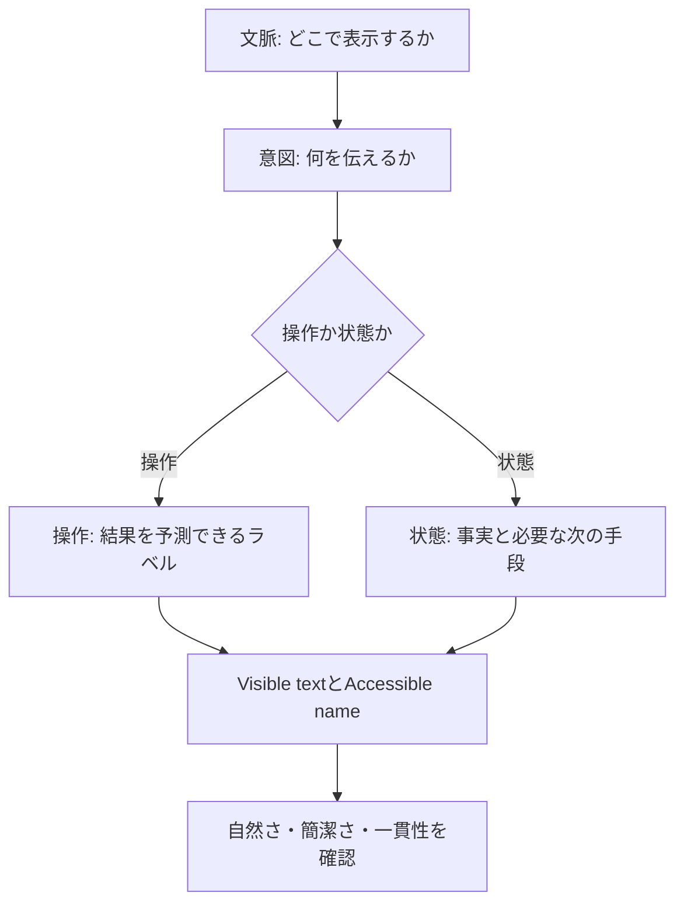

# KJR020's Blog UIライティング

読者が記事を探し、読み、次の場所へ移るための正規ライティング仕様。

## 判断フロー



文言は単独で決めない。周囲の見出し、直前の操作、視覚情報、支援技術へ伝わる情報を含めて設計する。

## 声の性格

KJR020's BlogのUIは、記事を主役にしながら操作と状態を分かりやすく伝える。

| 特性 | 基準 |
| --- | --- |
| 簡潔 | 判断に必要な情報だけを伝える |
| 自然 | 日常的で読み慣れた日本語を使う |
| 具体的 | 必要な場合は「記事」「検索」「Cosense」など対象を示す |
| 落ち着き | 事実を穏やかに伝え、過剰に謝らない |
| 誠実 | 分からない原因や読者の状態を推測しない |

記事本文では書き手の個性を表現し、UIでは操作や状態の理解を優先する。

## 6つの原則

### 1. 文脈から書き始める

近くの見出しや直前の操作から明らかな情報は繰り返さない。短くして意味が曖昧になる場合だけ対象を補う。

- 検索結果の末尾: `さらに表示`
- 404ページ: `トップへ戻る`
- 外部サービスへのリンク: 近くに`Cosenseのメモ書き`と書いてあれば`すべて見る`
- カード全体がリンクの場合: 見出しと役割を示す短い要約をリンク名とし、補助的な`開く`を重ねない
- カードの要約が名詞句の場合: 句点を付けない

### 2. 1つの文言に1つの役割を持たせる

- 見出し: 何の場所か
- 説明: 何ができるか
- ボタン: 何が起きるか
- 状態: 何が起きたか
- 補助文: 次に何ができるか

状態と対処方法が両方必要な場合は、見出しと本文へ分ける。

### 3. 操作後を予測できるラベルにする

文法を機械的に統一するのではなく、押した後に何が起きるか分かる言葉を選ぶ。

| 文脈 | ラベル |
| --- | --- |
| 検索結果の追加 | `さらに表示` |
| 読み込みの再実行 | `再読み込み` |
| 404からの移動 | `トップへ戻る` |
| 外部サービスへの移動 | `Cosense` |
| 入力内容の削除 | `検索条件をクリア` |

`OK`や`実行`のように、結果が分からないラベルは使わない。

### 4. 読者が知っている言葉を使う

内部実装ではなく、画面上の対象を表す。

- `検索インデックス`ではなく`検索`
- `取得データ`ではなく`記事`または`Cosense`
- `処理に失敗しました`ではなく、完了できなかったことを具体的に示す

Pagefind、API、proxyなどの実装語は、記事本文や開発者向けログに限定する。

### 5. 状態は事実を先に伝える

最初に何が起きたかを伝え、役に立つ場合だけ次の手段を続ける。原因が確認できない場合は説明を作らない。

```text
検索できません
しばらくしてから、もう一度お試しください。
```

読者ができることがない場合は、形だけの対処方法を付けない。

### 6. Visible textとAccessible nameを一緒に決める

テキストの表示ラベルがある場合、Accessible nameにはその文言を含める。意味が同じという理由だけで、別の文言へ置き換えない。

- 同じ役割の操作には、一貫した命名方法を使う。対象や文脈が異なる場合は、それを識別できる名前にする
- 対象名を補うかは、同じ操作の個数ではなく、操作対象や結果を識別できるかで判断する
- 機能が違う操作と、同じ機能の別インスタンスを区別する。複数のコードブロックのコピー操作へ、機械的に別の動詞を割り当てない
- Placeholderを入力欄の名前にしない。`label`または`aria-labelledby`を使う
- Icon-only buttonは、操作を具体的に名付ける
- `aria-expanded`や`aria-pressed`が伝える状態をAccessible nameで重複させない

必要な状態・操作結果は、視覚表示と支援技術の双方から把握できるようにする。表示文と`aria-live`は互いの代替ではない。フォーカスを移さずに生じる変化は、支援技術が通知できる形で公開する。

## 日本語の書き方

### 文体

- ボタンやリンクは、`戻る`、`開く`、`再読み込み`のように短く書く
- 説明文、空状態、エラー本文は「です・ます」で統一する
- `〜していただく`のような過剰な敬語は使わない
- 読者を責める表現や、必要以上に謝る表現は使わない

### 日本語と英語

- Navigationのカテゴリ名とサービス固有名は英語を使用できる
  - `Home`, `Posts`, `Search`, `Cosense`
- 説明、操作、状態は日本語を基本とする
- 技術固有名詞は公式表記を使う
  - `Astro`, `Pagefind`, `Cosense`, `Google Analytics`
- 同じ役割の中で日本語と英語を混在させない

### 句読点

- ボタン、リンク、Navigation、見出し、タグには句点を付けない
- 完全文の説明や状態には「。」を付ける
- 進行中を表す場合は全角の`…`を1つ使う
- 感嘆符は使用しない

### 数字・日付・件数

- 数字は算用数字を使う
- 記事日付は`2026年3月21日`形式とする
- 件数は対象と隣接させる
  - `12件の記事`
  - `3件のタグ`

## コンポーネント別の文法

| 部品 | 基準 | 例 |
| --- | --- | --- |
| Navigation | 名詞または固定カテゴリ名 | `Posts`, `Search` |
| Page title | 場所を示す名詞 | `Posts`, `Search` |
| Section title | 内容を示すカテゴリ名。並び順を表す修飾語は付けない | `Posts`, `Notes` |
| Section lead | 見出しだけで内容が分からない場合に、対象を一語で補う | `ブログ記事`, `Cosenseのメモ書き` |
| Button | 操作後を予測できる言葉 | `トップへ戻る`, `さらに表示` |
| Icon button | 操作を示す短い名前 | `メニューを開く`, `パネルを閉じる` |
| Theme switch | 対象名。状態は`aria-checked`で伝える | `ダークモード` |
| Search label | 入力の目的 | `記事を検索` |
| Search placeholder | 入力する内容 | `キーワードを入力` |
| Result count | 件数 + 対象 | `12件の記事` |
| Loading | 文脈上必要な進行状態 | `検索しています…` |
| Empty state | 状態 + 必要な次の手段 | `記事が見つかりません` |
| Error | 完了できなかったこと | `検索できません` |
| Success feedback | 完了した操作 | `コードをコピーしました` |
| External link | 移動先を示す。近くの説明で移動先が分かる場合は省く | `Cosense`, `すべて見る` |

## 状態メッセージ

下表の文言は、適用条件に対する用例である。固定仕様と明記したものを除き、条件を満たす別の自然な表現へ変えてよい。

| 適用条件 | 見出し・通知 | 本文・操作 |
| --- | --- | --- |
| 検索が完了し、条件に一致する結果が0件 | `検索結果が見つかりませんでした` | `キーワードを変えて検索してください。` |
| 検索を完了できなかった | 完了できなかったことを伝える | 再試行または記事一覧への導線がある場合だけ案内する。待つことを無条件に指示しない |
| 検索語が未入力 | `キーワードを入力して検索` | 追加説明を付けない |
| Cosenseの取得が成功し、表示対象が0件 | 対象がないことを伝える | 次の操作がない場合は本文を付けない |
| Cosenseの取得に失敗した | 読み込めなかったことを伝える | 操作: `再読み込み` |
| コピー操作が成功した | `コードをコピーしました` | Accessible Nameと`aria-live="polite"`の双方へ伝える |
| コピー操作が失敗した | `コードをコピーできませんでした` | コードを選択してコピーする手段を案内する |
| 指定されたページを表示できない | `ページが見つかりません` | `お探しのページが見つかりませんでした。` と `トップへ戻る`。原因の説明は標準では付けない |

取得の成功と失敗を、同じ0件表示へ流さない。読み込み前の状態を0件として表示しない。原因を確認していない場合は説明を作らない。

Cosenseの0件と404は、同じ文言にしない。どちらも「ページ」を扱うため、対象を識別できる表現を選ぶ。

### ローディング

短時間で完了する処理では、読み上げを増やさない。待っている対象を伝える必要がある場合だけ表示する。

### 空状態

検索結果0件、Collection 0件、404を同じ文言にしない。見出しには状態を、本文には役に立つ次の手段だけを書く。

### エラー

エラーは次の順で構成する。

1. 完了できなかったこと
2. 読者が次にできること
3. 必要な場合だけ、入力内容や保存状態への影響

技術詳細はログへ送り、読者向けメッセージには出さない。

### 完了

操作結果が画面から明らかな場合は、完了メッセージを重ねない。視覚だけでは分からない場合は、短い過去形で通知する。

## アクセシビリティ

- 入力欄には名前を関連付け、何を入力する欄かを視覚的にも識別できるようにする。視覚的に隠したlabelを使う場合は、常時見える別の手掛かりで目的を判断できることを確認する
- Placeholderは補助情報として扱い、Accessible nameには使わない
- Icon-only buttonには操作を表すAccessible nameを付ける
- リンクの目的を周囲の文脈へ委ねる場合は、その関係がプログラム上も把握できるようにする。視覚的に近いだけの情報を根拠に名前を省略しない
- 通常の状態通知には、作業を不必要に中断しない通知方法を使う。`aria-live="polite"`だけを適合方法としない。`role="status"`は暗黙の`aria-live="polite"`を持つ
- 同じ結果を複数の通知領域から重複して伝えない
- 追加通知を省く場合は、視覚と支援技術の双方で結果が把握できることを確認する
- ローディング中の細かな変化を繰り返し読み上げない
- 緊急でない情報に`role="alert"`や`aria-live="assertive"`を使わない

## レビューチェックリスト

### 文脈

- [ ] 周囲の見出しや直前の操作を踏まえているか
- [ ] 近くにある情報を繰り返していないか
- [ ] その文言がないと判断できない情報か

### 言葉

- [ ] 声に出して読んでも自然な日本語か
- [ ] 操作後に何が起きるか予測できるか
- [ ] 内部実装語や曖昧な総称が出ていないか
- [ ] 原因や読者の状態を推測していないか
- [ ] 同じ役割を同じ言葉で表しているか

### 表記

- [ ] ラベルに不要な句点がないか
- [ ] 完全文に句点があるか
- [ ] 三点リーダーは`…`か
- [ ] 数字、日付、件数の形式が統一されているか

### アクセシビリティ

- [ ] InputにPlaceholder以外の名前があるか
- [ ] Icon-only buttonに操作を表す名前があるか
- [ ] Visible textとAccessible nameが矛盾していないか
- [ ] 必要な状態変化が支援技術にも伝わるか
- [ ] ARIAが伝える状態を文言で重複していないか

## ガバナンス

この文書はUI文言の正本である。記述方針、変更管理、更新フローは[デザイン仕様の運用](design-system.md#運用)に従う。

この文書に記載するのは、採用済みの正規ルールと用例だけとする。

## 参考資料

- [Content — Atlassian Design System](https://atlassian.design/foundations/content/) - UI contentの基礎
- [Voice and tone — Atlassian Design System](https://atlassian.design/foundations/content/voice-tone) - 状況に応じた声とトーン
- [Error messages — Atlassian Design System](https://atlassian.design/foundations/content/designing-messages/error-messages) - エラーの構成と回復手段

## 関連ファイル

- [デザインシステムのコンテンツページ](../../src/design-system/pages/content.astro) - UIライティングの視覚サマリー（`pnpm dev`の`/design-system/content`）
- [デザイン仕様](design-system.md) - デザイン原則とSource of Truth
- [CommandPalette.tsx](../../src/components/search/CommandPalette.tsx) - 検索UI
- [ThemeToggleAnimated.tsx](../../src/components/theme/ThemeToggleAnimated.tsx) - Theme切り替え
- [ScrapboxCardList.tsx](../../src/components/scrapbox/ScrapboxCardList.tsx) - Cosenseの状態表示
- [posts/[...slug].astro](../../src/pages/posts/[...slug].astro) - Code Copy
