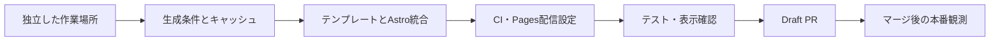

# サムネイル・OGP実装計画

別テンプレートと共通生成キャッシュを実装し、検証可能なDraft PRを作るための作業計画。2026-09-14作成。

## フロー



設計の詳細は[設計案](../architecture/thumbnail-ogp-design.md)を参照。実装範囲はブログ記事のカード・OGP、生成キャッシュ、CI設定、HTTP配信設定まで。Worker Cache API・R2・外部Scrapbox記事の生成は後続実験。

## 0. 作業場所と前提確認

元作業場所にはHome・PostCard・デザインシステム・記事等の未コミット変更がある。これらを一括コミット、stash、上書きしない。最新mainを確認して独立ブランチを作り、サムネイルに必要なfeaturedカードだけを最小限実装する。元作業場所の未公開UI全体をPRに持ち込まない。

```sh
git status --short
git fetch origin main
git worktree add /private/tmp/kjr020-thumbnail-implementation -b codex/thumbnail-cache origin/main
cd /private/tmp/kjr020-thumbnail-implementation
gh auth status
pnpm install --frozen-lockfile
pnpm astro sync
```

同名worktreeがある場合は状態を調べて再利用可否を判断する。元の設計書と本計画だけを作業場所にコピーする。ネットワーク・認証エラーは環境制限と区別して確認し、秘密情報を出力しない。

## 1. 生成条件とキャッシュ

提案配置: `src/lib/generated-images/`。名前は実装時に既存構成へ合わせてよい。

| 作業 | 完了の証拠 |
| --- | --- |
| 入力型、用途別プリセット、正規化 | 同値入力・タグ順序・未指定値をテスト |
| SHA-256キー | タイトル、素材、サイズ、形式、品質、用途別テンプレート変更が反映される |
| テンプレート依存を用途別に分離 | カード変更時にOGPキーが変わらない |
| ディスクキャッシュ、検証情報、atomic write | HIT時に描画しない。欠損・破損は再生成 |
| JSONログ | layer、HIT/MISS、renderMs、totalMs、bytesが観測できる |

TDDで上記の振る舞いを先にテストする。生成物と検証情報は`.cache/generated-images/`に置き、Git除外する。画像・フォントなど描画に影響する依存を漏らさない。クライアントバンドルへNode.js処理を含めない。

学習用コマンドとして`pnpm thumbnails:experiment`を追加する。同じfixtureを隔離した一時キャッシュで2回生成し、MISS/HIT、キー変更、用途分離を一度に再現する。ユーザーの通常キャッシュを削除しない。

## 2. テンプレートとロゴ

- カード: タイトル・ブログ名なし、ロゴ最大3個、ロゴ0個は図形。480×270/960×540 WebP。
- OGP: 既存の1200×630 PNGを活用し、タイトル・ブログ名・投稿日と補助ロゴ。
- ロゴはローカル素材、別名対応、重複除去、表示順固定。公式の出典・利用条件を記録する。
- 既存デザイントークンへ合わせ、Light/Dark両方で読める画像にする。
- `category`は任意。既存記事のfrontmatterの一括変更は不要。

## 3. Astro・カードへの接続

最初に導入済みAstroの公式ドキュメント・型定義でコレクション利用可能な実行位置を確認する。設計案のフック案は未検証なので、そのまま前提にしない。静的エンドポイントと共通のメモ化された生成関数でも要件を満たせるなら採用し、設計書を実装へ合わせる。

公開記事だけのマニフェストを構築し、カードと記事ページの両方から参照する。dev/buildどちらでも動作し、編集時に古いマニフェストを使い続けない。旧固定OGP経路は互換出力として残す。

Homeの対象カードに16:9画像、width/height、srcset/sizesを設定する。記事タイトルはHTML表示。手動heroImage優先。Archive・Tag一覧は全幅行を保つ。関連ガイド、デザインシステム標本、実装、テストを同じ変更で更新する。

## 4. インフラをコードで設定する

### Pages

`public/_headers`に追加し、`dist/_headers`へ出力されたことを確認する。

```text
/generated-images/*
  Cache-Control: public, max-age=31536000, immutable
```

HTML・固定OGPへimmutableを適用しない。初期案ではR2 binding、新しいWorker、Cloudflare Images、追加の有料契約、Cache Everythingルールを作らない。既存Pagesプロジェクトを使う。

既存workflowのPagesプロジェクト名は`kjr020-blog`、wrangler.tomlのnameは`kjr020-github-io`で異なる。デプロイ先は既存workflowの明示指定を維持し、調査なしに新規プロジェクトを作成しない。

### GitHub Actions

deploy workflowのinstall後/build前に画像キャッシュrestore、build成功後にsaveを追加する。環境識別子をrestore prefixに含め、保存キーにはrun ID・attempt等を含める。キャッシュを取得できなくても生成は成功する。

旧画像引き継ぎは生成キャッシュとは別に扱う。直前の公開済み本番runの「そのrunで現在参照している画像とmanifest」のartifactだけを取得する。継承画像を再帰的にartifactへ積まない。デプロイ前に新artifactを保存し、run選択はmain・対象workflowに加えて実際のdeployment成功状態で絞る。workflow全体の成功だけでは、公開後に後続処理が失敗したrunを見落とすため不十分。初回導入を明示的に扱い、期限切れ・欠損を初回と誤判定しない。必要な読み取り権限だけを追加する。artifact保持期限を明記し、復元不可時の復旧手順（前デプロイから回収または運用者による保持範囲変更）を書く。

新しいActions参照は公式のcommit SHAを確認して固定する。実装負荷や利用可能な権限で旧画像保持を保証できない場合は、その項目を未完了としてDraft PRへ明記する。こっそり保証を弱めない。

既存の`CLOUDFLARE_API_TOKEN`、`CLOUDFLARE_ACCOUNT_ID`、`TAKUMI_GUARD_TOKEN`を利用し、値を表示・コミットしない。PR作成段階で秘密情報の新規登録や権限拡大は不要。

## 5. 検証コマンド

```sh
pnpm thumbnails:experiment
pnpm astro sync
pnpm typecheck
pnpm lint
pnpm format:check
pnpm test:run
pnpm test:design-system
pnpm build
pnpm build
pnpm test:e2e
git diff --check
```

2回目buildでは生成HITをログで確認する。テストは既存CIと同じ基準を使い、失敗した場合は既存原因か変更原因か切り分ける。スナップショットは実画面を確認して対象だけ更新する。全テストの無差別更新は禁止。

`pnpm thumbnails:verify`を追加し、生成manifest・HTMLから参照する画像の存在、寸法・形式、公開記事数、総画像数・容量、下書き除外を検査する。devの標本とビルド成果物を混同しない。

## 6. 公開時のコマンドと観測

この節はPRマージ後の運用手順。今回の委譲はDraft PR作成までで、mainへのpush・マージ・本番デプロイは実行しない。

```sh
pnpm exec wrangler whoami
pnpm exec wrangler pages project list
gh secret list --repo KJR020/kjr020.github.io
gh run list --repo KJR020/kjr020.github.io --workflow deploy.yml --limit 5
```

Pages/Workers契約、既存Cache Rules、Browser Cache TTLの上書き、CI使用量・artifact容量を読み取り確認する。無料枠に収まることは実測・契約確認後に判定する。

マージ後は既存main pushによるdeploy workflowを利用する。手動再実行が必要な場合のみ以下を使う。

```sh
gh workflow run deploy.yml --repo KJR020/kjr020.github.io --ref main
```

デプロイ成功後、公開HTMLの実際の生成画像URLを`THUMBNAIL_URL`に指定してGETする。クエリでキャッシュバスターを足さない。

```sh
curl -sS -D /private/tmp/thumbnail-headers-first.txt -o /private/tmp/thumbnail-first.webp -w 'status=%{http_code} ttfb=%{time_starttransfer} total=%{time_total}\n' "$THUMBNAIL_URL"
curl -sS -D /private/tmp/thumbnail-headers-second.txt -o /private/tmp/thumbnail-second.webp -w 'status=%{http_code} ttfb=%{time_starttransfer} total=%{time_total}\n' "$THUMBNAIL_URL"
```

Cache-Control、ETag、CF-Cache-Status、Ageを記録し、返らないヘッダーは未提供と記録する。ブラウザはDisable cacheをオフにして通常再訪し、memory/disk cacheと転送量を確認する。CDN MISSは画像再生成ではない。Pages設定や拠点によって連続HITにならない場合も調べて記録する。

## 7. レビューとPR作成

軽量モデルが実装とテストを担当し、親エージェントが差分・キー設計・インフラ設定・未完了事項をレビューする。認証が使えない場合は接続済みGitHubツールを確認し、利用できる方法で作成する。

```sh
git diff --stat origin/main...HEAD
git status --short
git push -u origin codex/thumbnail-cache
gh pr create --draft --base main --head codex/thumbnail-cache --title '記事カード用サムネイルとOGPの生成キャッシュを追加' --body-file /private/tmp/thumbnail-pr-body.md
```

PR本文は問題・変更後の動作・検証結果・マージ後に必要なインフラ観測を日本語で記載する。実施していない検証を成功と書かない。本番でしかできないHTTP/CDN確認は明示して残す。

## 関連ファイル

公式確認先: [Astro Integration API](https://docs.astro.build/en/reference/integrations-reference/)、[GitHub artifactの保持と取得](https://docs.github.com/en/actions/how-tos/manage-workflow-runs/download-workflow-artifacts)。本リポジトリはpublicで、artifact保持は最大90日という制約がある。[保持期間の制約](https://docs.github.com/en/organizations/managing-organization-settings/configuring-the-retention-period-for-github-actions-artifacts-and-logs-in-your-organization)

- [設計案](../architecture/thumbnail-ogp-design.md)
- [PRガイド](pull-request-guidelines.md)
- [デプロイ設定](../../.github/workflows/deploy.yml)
- [CI設定](../../.github/workflows/ci.yml)
- [デザインシステム](../blog-design-system.md)
